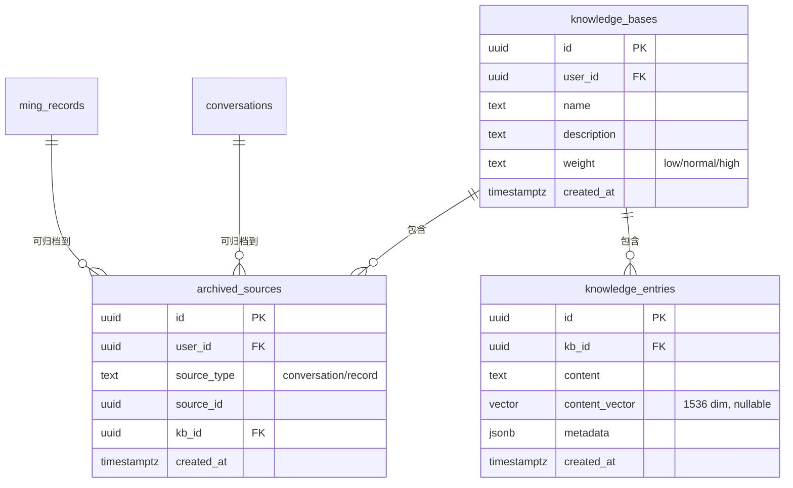
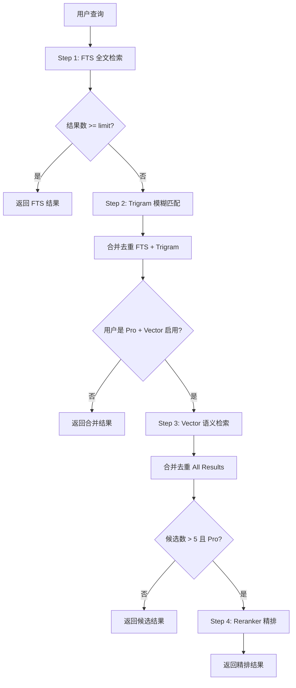
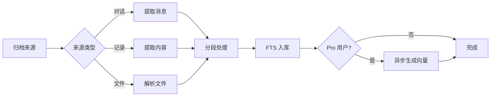
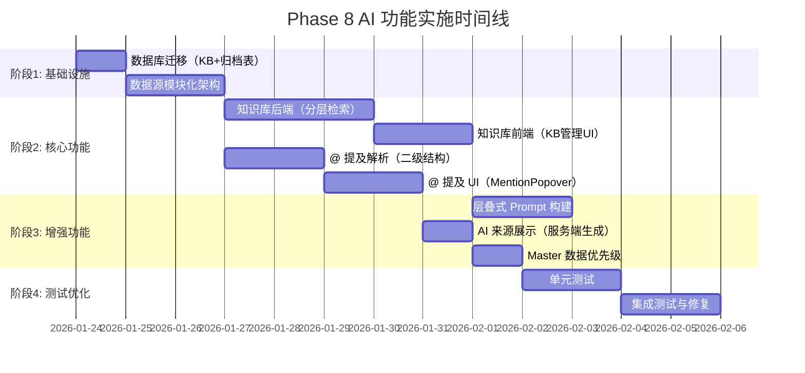
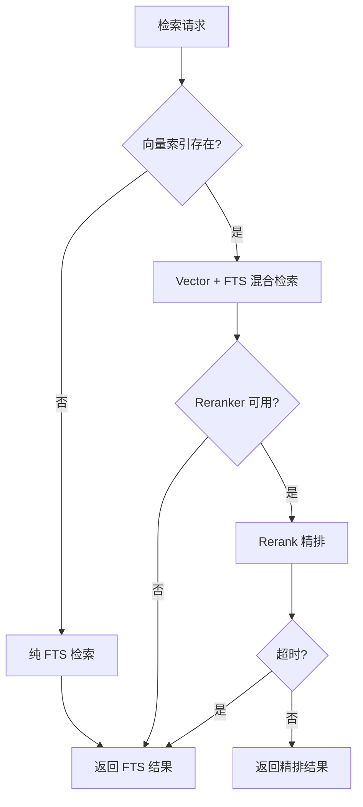

# MingAI Phase 8 AI 功能实施计划

**版本**: v1.10
**创建日期**: 2026-01-23
**更新日期**: 2026-01-24
**状态**: 📋 待评审

> [!NOTE]
> v1.7 更新：根据第六轮架构评审意见修复权限和类型问题：
> - **P0-1** 修复 check_vector_index_exists 权限与调用链不一致
> - **P0-2** ADR-024 明确 SECURITY DEFINER 例外情况
> - **P0-3** search_knowledge_vector 参数改为 float8[] 避免 supabase-js 序列化问题
> - **P1-1** SearchConfig 类型与 SQL 白名单对齐
> - 新增 ADR-029/030，当前共 **30 个 ADR**

---

## 1. 概述

本文档详细描述 MingAI Phase 8 中 AI 相关功能的实施计划，涵盖：

| 模块 | 优先级 | 复杂度 | 备注 |
|------|--------|--------|------|
| 知识库系统 | P0 | 高 | 核心功能，分离归档映射 |
| @ 提及功能 | P0 | 中 | 收敛为二级结构 |
| 统一数据 API | P1 | 中 | 模块化设计 |
| 个性化系统 | P1 | 中 | 层叠式 Prompt |
| AI 回复来源展示 | P1 | 低 | 绑定实际注入内容 |
| Master 数据优先级 | P2 | 低 | Token 限制策略 |
| ~~AI SDK 统一架构~~ | ~~P2~~ | ~~中~~ | **移至 Phase 9** |

> [!CAUTION]
> AI SDK 迁移已移至 Phase 9，避免干扰核心功能测试。当前 SSE 架构稳定，无需更改。

---

## 2. 现有架构分析

### 2.1 当前 AI 模块结构

```
src/lib/
├── ai.ts                    # AI 调用封装（流式/非流式）
├── ai-config.ts             # 模型配置（动态加载）
├── ai-access.ts             # 访问权限控制
├── ai-analysis.ts           # 分析结果处理
├── ai-analysis-query.ts     # 分析查询
└── ai-providers/            # 多供应商适配
    ├── base.ts
    ├── deepseek.ts
    ├── glm.ts
    ├── gemini.ts
    ├── qwen.ts
    └── openai-compatible.ts
```

### 2.2 现有数据表

| 数据类型 | 表名 | 关键字段 |
|---------|------|----------|
| 八字命盘 | `bazi_charts` | `chart_data`, `name`, `birth_date` |
| 紫微命盘 | `ziwei_charts` | `chart_data`, `name`, `birth_date` |
| 塔罗记录 | `tarot_readings` | `cards`, `question`, `spread_id` |
| 六爻记录 | `liuyao_divinations` | `hexagram_code`, `question` |
| MBTI记录 | `mbti_readings` | `mbti_type`, `scores` |
| 合盘记录 | `hepan_charts` | `person1_birth`, `person2_birth`, `type` |
| 面相记录 | `face_readings` | `analysis_type` |
| 手相记录 | `palm_readings` | `hand_type`, `analysis_type` |
| 命理记录 | `ming_records` | `title`, `content`, `category`, `tags` |
| 对话历史 | `conversations` | `messages`, `source_type`, `source_data` |

### 2.3 当前聊天组件

- [ChatComposer.tsx](file:///d:/AAA-Study/Projects/MingAI/src/components/chat/ChatComposer.tsx) - 输入框、附件、模型选择
- [ChatMessageList.tsx](file:///d:/AAA-Study/Projects/MingAI/src/components/chat/ChatMessageList.tsx) - 消息列表渲染
- [BaziChartSelector.tsx](file:///d:/AAA-Study/Projects/MingAI/src/components/chat/BaziChartSelector.tsx) - 命盘选择器

---

## 3. 功能模块详细设计

### 3.1 知识库系统 (P0)

> [!IMPORTANT]
> 核心功能，需优先实现。采用 Supabase Postgres + FTS + pgvector（条件性） + Qwen3-Reranker 分层检索架构。

#### 3.1.1 核心概念分离

> [!WARNING]
> 关键架构决策：分离 `knowledge_bases`（逻辑容器）与 `archived_sources`（归档映射），支持一个来源多次引用。

| 概念 | 表名 | 职责 |
|------|------|------|
| 知识库 | `knowledge_bases` | 用户创建的逻辑知识集合（如"职业规划"、"感情咨询"） |
| 归档来源 | `archived_sources` | 记录 conversation / record → KB 的映射关系 |
| 知识条目 | `knowledge_entries` | 实际存储的知识内容块 |



#### 3.1.2 数据库设计

##### [NEW] `supabase/migrations/20260124_create_knowledge_base_tables.sql`

```sql
-- ============================================
-- 0. 扩展启用（必须在所有建表之前！）
-- ============================================
-- 重要：vector 类型依赖 pgvector 扩展，必须先启用

-- pgvector 扩展（向量搜索）
-- 注意：Supabase 已预装，但需要显式启用
CREATE EXTENSION IF NOT EXISTS vector WITH SCHEMA extensions;

-- 确保 vector 类型在 search_path 中可用
-- Supabase 默认 search_path 包含 extensions，若不包含需添加：
-- ALTER DATABASE postgres SET search_path TO public, extensions;

-- pg_trgm 扩展（中文 trigram 支持）
CREATE EXTENSION IF NOT EXISTS pg_trgm;

-- pgcrypto 扩展（gen_random_uuid 依赖）
-- 注意：Supabase 通常已预装 pgcrypto，但为确保 migration 自解释，显式声明
-- 如果 Supabase 版本较新，可能使用内置的 gen_random_uuid()（PG13+）
CREATE EXTENSION IF NOT EXISTS pgcrypto;

-- ============================================
-- 1. 知识库表（逻辑容器）
-- ============================================
CREATE TABLE public.knowledge_bases (
    id UUID PRIMARY KEY DEFAULT gen_random_uuid(),
    user_id UUID NOT NULL REFERENCES auth.users(id) ON DELETE CASCADE,
    name TEXT NOT NULL,
    description TEXT,
    weight TEXT CHECK (weight IN ('low', 'normal', 'high')) DEFAULT 'normal',
    created_at TIMESTAMPTZ DEFAULT now(),
    updated_at TIMESTAMPTZ DEFAULT now()
);

-- ============================================
-- 2. 归档来源映射表（多对多）
-- ============================================
CREATE TABLE public.archived_sources (
    id UUID PRIMARY KEY DEFAULT gen_random_uuid(),
    user_id UUID NOT NULL REFERENCES auth.users(id) ON DELETE CASCADE,
    source_type TEXT NOT NULL CHECK (source_type IN ('conversation', 'record')),
    source_id UUID NOT NULL,
    kb_id UUID NOT NULL REFERENCES public.knowledge_bases(id) ON DELETE CASCADE,
    created_at TIMESTAMPTZ DEFAULT now(),
    -- 同一来源可以归档到同一知识库只能一次
    UNIQUE (source_type, source_id, kb_id)
);

-- ============================================
-- 3. 知识条目表
-- ============================================
-- 注意：添加显式列 source_type/source_id/chunk_index 用于 upsert
-- PostgREST 的 onConflict 只支持真实列，不支持 JSON path
CREATE TABLE public.knowledge_entries (
    id UUID PRIMARY KEY DEFAULT gen_random_uuid(),
    kb_id UUID NOT NULL REFERENCES public.knowledge_bases(id) ON DELETE CASCADE,
    content TEXT NOT NULL,
    -- 向量维度可配置（不硬编码 1536）
    -- 常见维度：OpenAI=1536, Qwen=1024, BGE=768
    content_vector vector,  -- 可选，Pro 专属，维度在入库时确定

    -- ============================================
    -- 显式列（用于 upsert 唯一约束）
    -- ============================================
    source_type TEXT NOT NULL,           -- 'conversation' | 'record' | 'file'
    source_id TEXT NOT NULL,             -- UUID 或文件名
    chunk_index INT NOT NULL DEFAULT 0,  -- 分块索引

    -- metadata 保留扩展字段（embedding_model, embedding_dim 等）
    metadata JSONB NOT NULL DEFAULT '{}',
    created_at TIMESTAMPTZ DEFAULT now(),

    -- 唯一约束：同一来源的同一分块只能有一条记录
    CONSTRAINT knowledge_entries_source_unique
        UNIQUE (kb_id, source_type, source_id, chunk_index),

    -- 约束：如果有向量，metadata 必须包含 embedding_model 和 embedding_dim
    CONSTRAINT vector_metadata_check CHECK (
        content_vector IS NULL OR (
            metadata ? 'embedding_model' AND
            metadata ? 'embedding_dim'
        )
    )
);

-- metadata 结构示例（扩展字段）：
-- {
--   "embedding_model": "text-embedding-3-small",  -- 必填（向量条目）
--   "embedding_dim": 1536,                         -- 必填（向量条目）
--   "message_ids": ["uuid1", "uuid2"],             -- 可选，对话来源
--   "category": "career",                          -- 可选，记录分类
--   "tags": ["工作", "规划"]                        -- 可选，标签
-- }

-- ============================================
-- 4. 索引设计
-- ============================================

-- FTS 索引（所有用户可用）
-- 注意：'simple' 对中文分词效果有限，配合 trigram 使用
CREATE INDEX knowledge_entries_fts_idx
    ON public.knowledge_entries
    USING GIN (to_tsvector('simple', content));

-- Trigram 索引（中文模糊搜索兜底）
CREATE INDEX knowledge_entries_trgm_idx
    ON public.knowledge_entries
    USING GIN (content gin_trgm_ops);

-- ============================================
-- 5. 向量索引规则（重要：分维度 partial index）
-- ============================================

-- 注意：向量索引不在 migration 中创建，由 Edge Function 动态创建
-- 原因：不同 embedding_model 维度不同，需要按维度分别建索引

-- 示例：为 1536 维向量创建 partial index
-- CREATE INDEX knowledge_entries_vector_1536_idx
--     ON public.knowledge_entries
--     USING ivfflat ((content_vector::vector(1536)) vector_cosine_ops)
--     WITH (lists = 100)
--     WHERE (metadata->>'embedding_dim')::int = 1536;

-- 示例：为 1024 维向量创建 partial index
-- CREATE INDEX knowledge_entries_vector_1024_idx
--     ON public.knowledge_entries
--     USING ivfflat ((content_vector::vector(1024)) vector_cosine_ops)
--     WITH (lists = 100)
--     WHERE (metadata->>'embedding_dim')::int = 1024;

-- 查询时必须同样 cast 到固定维度：
-- SELECT * FROM knowledge_entries
-- WHERE (metadata->>'embedding_dim')::int = 1536
--   AND content_vector::vector(1536) <=> query_vector::vector(1536) < 0.5;

-- 归档来源查询优化
CREATE INDEX archived_sources_user_idx ON public.archived_sources(user_id);
CREATE INDEX archived_sources_source_idx ON public.archived_sources(source_type, source_id);
CREATE INDEX archived_sources_kb_idx ON public.archived_sources(kb_id);

-- ============================================
-- 6. RLS 策略
-- ============================================
ALTER TABLE public.knowledge_bases ENABLE ROW LEVEL SECURITY;
ALTER TABLE public.archived_sources ENABLE ROW LEVEL SECURITY;
ALTER TABLE public.knowledge_entries ENABLE ROW LEVEL SECURITY;

CREATE POLICY "用户只能访问自己的知识库" ON public.knowledge_bases
    FOR ALL USING (auth.uid() = user_id);

CREATE POLICY "用户只能访问自己的归档来源" ON public.archived_sources
    FOR ALL USING (auth.uid() = user_id);

CREATE POLICY "用户只能访问自己的知识条目" ON public.knowledge_entries
    FOR ALL USING (
        kb_id IN (SELECT id FROM public.knowledge_bases WHERE user_id = auth.uid())
    );
```

##### [NEW] `supabase/migrations/20260124_extend_source_tables.sql`

```sql
-- ============================================
-- 归档状态处理方案：使用视图计算（推荐）
-- 不在源表存储 is_archived，避免多 KB 归档时的一致性问题
-- ============================================

-- 方案 A：计算视图（推荐）
-- 通过视图动态计算归档状态，无需维护冗余字段
CREATE OR REPLACE VIEW public.conversations_with_archive_status AS
SELECT
    c.*,
    EXISTS (
        SELECT 1 FROM public.archived_sources a
        WHERE a.source_type = 'conversation'
        AND a.source_id = c.id
    ) AS is_archived,
    (
        SELECT array_agg(kb_id)
        FROM public.archived_sources a
        WHERE a.source_type = 'conversation'
        AND a.source_id = c.id
    ) AS archived_kb_ids
FROM public.conversations c;

CREATE OR REPLACE VIEW public.ming_records_with_archive_status AS
SELECT
    r.*,
    EXISTS (
        SELECT 1 FROM public.archived_sources a
        WHERE a.source_type = 'record'
        AND a.source_id = r.id
    ) AS is_archived,
    (
        SELECT array_agg(kb_id)
        FROM public.archived_sources a
        WHERE a.source_type = 'record'
        AND a.source_id = r.id
    ) AS archived_kb_ids
FROM public.ming_records r;

-- 视图 RLS（继承基表权限）
ALTER VIEW public.conversations_with_archive_status SET (security_invoker = on);
ALTER VIEW public.ming_records_with_archive_status SET (security_invoker = on);
```

##### 归档视图使用规范

> [!CAUTION]
> **强制规范**：前端和 API 必须使用视图查询归档状态，禁止直接查基表后手动计算。

**必须使用视图的场景**：

| 场景 | 正确做法 | 错误做法 |
|------|----------|----------|
| 对话列表显示归档状态 | 查询 `conversations_with_archive_status` | 查询 `conversations` + 手动 JOIN `archived_sources` |
| 记录列表显示归档状态 | 查询 `ming_records_with_archive_status` | 查询 `ming_records` + 前端计算 |
| 按归档状态筛选 | `WHERE is_archived = true` | 子查询 `archived_sources` |

**代码示例**：

```typescript
// ✅ 正确：使用视图
export async function getConversationsWithArchiveStatus(userId: string) {
    const { data } = await supabase
        .from('conversations_with_archive_status')
        .select('*')
        .eq('user_id', userId)
        .order('created_at', { ascending: false });
    return data;
}

// ✅ 正确：按归档状态筛选
export async function getArchivedConversations(userId: string) {
    const { data } = await supabase
        .from('conversations_with_archive_status')
        .select('*')
        .eq('user_id', userId)
        .eq('is_archived', true);  // 视图计算字段
    return data;
}

// ❌ 错误：直接查基表后手动计算
export async function getConversationsWrong(userId: string) {
    const { data: conversations } = await supabase
        .from('conversations')
        .select('*')
        .eq('user_id', userId);

    // 错误：前端手动查询归档状态
    const { data: archives } = await supabase
        .from('archived_sources')
        .select('source_id')
        .eq('source_type', 'conversation');

    // 错误：前端计算 is_archived
    return conversations?.map(c => ({
        ...c,
        is_archived: archives?.some(a => a.source_id === c.id)
    }));
}
```

**必须修改的文件清单**：

| 文件 | 修改内容 |
|------|----------|
| `src/app/api/conversations/route.ts` | 改用 `conversations_with_archive_status` |
| `src/app/api/records/route.ts` | 改用 `ming_records_with_archive_status` |
| `src/app/chat/page.tsx` | 列表查询改用视图 |
| `src/app/records/page.tsx` | 列表查询改用视图 |
| `src/components/chat/ChatHistoryList.tsx` | 显示归档标记 |
| `src/components/records/RecordList.tsx` | 显示归档标记 |

> [!WARNING]
> **is_archived 一致性规则**：
> - 不在源表存储 `is_archived` 冗余字段
> - 归档状态通过 `archived_sources` 表动态计算
> - `is_archived = EXISTS(archived_sources WHERE source_type/source_id)`
> - 取消某个 KB 的归档后，若该 source 仍在其他 KB 中，状态仍为已归档

##### 服务端辅助函数

```typescript
// src/lib/knowledge-base/archive-status.ts

/**
 * 检查来源是否已归档（到任意知识库）
 */
export async function isSourceArchived(
    sourceType: 'conversation' | 'record',
    sourceId: string
): Promise<boolean> {
    const { count } = await supabase
        .from('archived_sources')
        .select('*', { count: 'exact', head: true })
        .eq('source_type', sourceType)
        .eq('source_id', sourceId);
    return (count ?? 0) > 0;
}

/**
 * 获取来源归档到的所有知识库
 */
export async function getArchivedKbIds(
    sourceType: 'conversation' | 'record',
    sourceId: string
): Promise<string[]> {
    const { data } = await supabase
        .from('archived_sources')
        .select('kb_id')
        .eq('source_type', sourceType)
        .eq('source_id', sourceId);
    return data?.map(d => d.kb_id) ?? [];
}
```

#### 3.1.3 向量索引策略

> [!CAUTION]
> 向量索引不应在 migration 中默认创建。Supabase Free 可能失败，会阻断整条 pipeline。

**策略**：向量索引延后创建，由 feature flag 控制。

##### [NEW] `src/lib/knowledge-base/vector-index.ts`

```typescript
/**
 * 向量索引管理
 * 仅 Pro 会员 + 后台管理触发
 */
export async function createVectorIndexIfNeeded(
    supabase: SupabaseClient
): Promise<{ success: boolean; error?: string }> {
    // 1. 检查是否已存在索引
    const { data: indexExists } = await supabase.rpc('check_vector_index_exists');
    if (indexExists) return { success: true };

    // 2. 检查 feature flag
    const vectorEnabled = await getFeatureFlag('VECTOR_SEARCH_ENABLED');
    if (!vectorEnabled) {
        return { success: false, error: 'Vector search not enabled' };
    }

    // 3. 触发后台任务创建索引（不在 RPC 中执行 CONCURRENTLY）
    // 方案 A：通过 Edge Function 触发（推荐）
    // 方案 B：通过管理脚本直接连接数据库执行
    try {
        await triggerVectorIndexJob();  // 异步任务
        return { success: true };
    } catch (error) {
        console.error('Failed to trigger vector index job:', error);
        return { success: false, error: String(error) };
    }
}

/**
 * 触发向量索引创建任务
 * 通过 Edge Function 或管理脚本执行（避免事务限制）
 */
async function triggerVectorIndexJob(): Promise<void> {
    // 方案 A：调用 Edge Function（使用 service_role 直连数据库）
    const response = await fetch(`${process.env.SUPABASE_URL}/functions/v1/create-vector-index`, {
        method: 'POST',
        headers: {
            'Authorization': `Bearer ${process.env.SUPABASE_SERVICE_ROLE_KEY}`,
            'Content-Type': 'application/json'
        }
    });
    if (!response.ok) throw new Error('Vector index job failed');
}
```

##### [NEW] `supabase/functions/create-vector-index/index.ts` (Edge Function)

> [!CAUTION]
> `CREATE INDEX CONCURRENTLY` 不能在事务块中执行，因此不能用普通 RPC 函数。
> 必须通过 Edge Function 直连数据库执行（Edge Function 可以控制事务边界）。

> [!WARNING]
> **安全要求**：
> 1. service_role 鉴权必须使用严格匹配，禁止 `includes()` 模糊匹配
> 2. 此函数只能在服务端调用，禁止客户端直接访问
> 3. 部署时设置 `verify_jwt: false`（因为使用自定义 service_role 鉴权）

```typescript
// supabase/functions/create-vector-index/index.ts
// 部署命令: supabase functions deploy create-vector-index --no-verify-jwt

import postgres from 'https://deno.land/x/postgresjs@v3.4.5/mod.js';

// 支持的向量维度配置
const VECTOR_DIMENSIONS = [1536, 1024, 768] as const;

interface CreateIndexRequest {
    dimension?: number;  // 可选，不传则为所有已有维度创建索引
}

Deno.serve(async (req: Request) => {
    // ============================================
    // 1. 严格的 service_role 鉴权
    // ============================================
    const authHeader = req.headers.get('Authorization');
    const serviceRoleKey = Deno.env.get('SUPABASE_SERVICE_ROLE_KEY');

    if (!serviceRoleKey) {
        console.error('SUPABASE_SERVICE_ROLE_KEY not configured');
        return new Response(JSON.stringify({ error: 'Server misconfigured' }), {
            status: 500,
            headers: { 'Content-Type': 'application/json' }
        });
    }

    // 严格匹配：Bearer token 必须完全等于 service_role_key
    const expectedAuth = `Bearer ${serviceRoleKey}`;
    if (authHeader !== expectedAuth) {
        console.warn('Unauthorized access attempt');
        return new Response(JSON.stringify({ error: 'Unauthorized' }), {
            status: 401,
            headers: { 'Content-Type': 'application/json' }
        });
    }

    // ============================================
    // 2. 解析请求参数 + 输入校验
    // ============================================
    let requestedDimension: number | undefined;
    try {
        if (req.method === 'POST') {
            const body = await req.json() as CreateIndexRequest;
            requestedDimension = body.dimension;
        }
    } catch {
        // GET 请求或空 body，使用默认行为
    }

    // 输入校验：dimension 必须是安全的整数
    // 防止 SQL 注入（虽然 sql.unsafe 只用于固定维度列表，但仍需防御）
    if (requestedDimension !== undefined) {
        // 1. 必须是正整数
        if (!Number.isInteger(requestedDimension) || requestedDimension <= 0) {
            return new Response(JSON.stringify({
                error: 'Invalid dimension: must be a positive integer'
            }), {
                status: 400,
                headers: { 'Content-Type': 'application/json' }
            });
        }

        // 2. 必须在允许的维度列表中（防止任意输入）
        if (!VECTOR_DIMENSIONS.includes(requestedDimension as typeof VECTOR_DIMENSIONS[number])) {
            return new Response(JSON.stringify({
                error: `Invalid dimension: must be one of ${VECTOR_DIMENSIONS.join(', ')}`,
                allowedDimensions: VECTOR_DIMENSIONS
            }), {
                status: 400,
                headers: { 'Content-Type': 'application/json' }
            });
        }
    }

    // ============================================
    // 3. 使用 postgres.js 直连数据库（支持 CONCURRENTLY）
    // ============================================
    const databaseUrl = Deno.env.get('SUPABASE_DB_URL');
    if (!databaseUrl) {
        return new Response(JSON.stringify({ error: 'Database URL not configured' }), {
            status: 500,
            headers: { 'Content-Type': 'application/json' }
        });
    }

    // postgres.js 不使用连接池，每次创建新连接
    const sql = postgres(databaseUrl, {
        max: 1,  // 单连接
        idle_timeout: 20,
        connect_timeout: 30
    });

    try {
        const results: Array<{ dimension: number; status: string; error?: string }> = [];
        const dimensionsToProcess = requestedDimension
            ? [requestedDimension]
            : VECTOR_DIMENSIONS;

        for (const dim of dimensionsToProcess) {
            const indexName = `knowledge_entries_vector_${dim}_idx`;

            // P1: 额外安全校验 - indexName 只允许字母数字下划线
            if (!/^[a-zA-Z0-9_]+$/.test(indexName)) {
                console.error(`Invalid index name pattern: ${indexName}`);
                results.push({
                    dimension: dim,
                    status: 'failed',
                    error: 'Invalid index name pattern'
                });
                continue;
            }

            try {
                // 检查索引是否已存在
                const [existing] = await sql`
                    SELECT 1 FROM pg_indexes
                    WHERE schemaname = 'public'
                      AND indexname = ${indexName}
                `;

                if (existing) {
                    results.push({ dimension: dim, status: 'already_exists' });
                    continue;
                }

                // 检查是否有该维度的数据
                const [hasData] = await sql`
                    SELECT EXISTS (
                        SELECT 1 FROM public.knowledge_entries
                        WHERE (metadata->>'embedding_dim')::int = ${dim}
                          AND content_vector IS NOT NULL
                        LIMIT 1
                    ) as has_data
                `;

                if (!hasData?.has_data) {
                    results.push({ dimension: dim, status: 'skipped_no_data' });
                    continue;
                }

                // ============================================
                // 4. 使用 CONCURRENTLY 创建 partial index
                // ============================================
                // 注意：CONCURRENTLY 必须在事务外执行
                // postgres.js 默认不开启事务，所以这里可以使用
                await sql.unsafe(`
                    CREATE INDEX CONCURRENTLY IF NOT EXISTS ${indexName}
                    ON public.knowledge_entries
                    USING ivfflat ((content_vector::vector(${dim})) vector_cosine_ops)
                    WITH (lists = 100)
                    WHERE (metadata->>'embedding_dim')::int = ${dim}
                `);

                results.push({ dimension: dim, status: 'created' });
            } catch (error) {
                console.error(`Failed to create index for dimension ${dim}:`, error);
                results.push({
                    dimension: dim,
                    status: 'failed',
                    error: error instanceof Error ? error.message : String(error)
                });
            }
        }

        return new Response(JSON.stringify({
            success: true,
            results,
            timestamp: new Date().toISOString()
        }), {
            headers: { 'Content-Type': 'application/json' }
        });

    } catch (error) {
        console.error('Database operation failed:', error);
        return new Response(JSON.stringify({
            success: false,
            error: error instanceof Error ? error.message : String(error)
        }), {
            status: 500,
            headers: { 'Content-Type': 'application/json' }
        });
    } finally {
        // 关闭连接
        await sql.end();
    }
});
```

##### Edge Function 配置文件

```jsonc
// supabase/functions/create-vector-index/deno.json
{
    "imports": {
        "postgres": "https://deno.land/x/postgresjs@v3.4.5/mod.js"
    },
    "compilerOptions": {
        "strict": true
    }
}
```

##### 服务端调用示例

> [!IMPORTANT]
> 此函数**只能**从服务端调用，禁止客户端直接访问。

```typescript
// src/lib/knowledge-base/vector-index.ts (server-only)
// 文件顶部添加 server-only 标记
import 'server-only';

/**
 * 触发向量索引创建（服务端专用）
 * @param dimension 可选，指定维度；不传则为所有已有维度创建
 */
export async function triggerVectorIndexCreation(dimension?: number): Promise<{
    success: boolean;
    results?: Array<{ dimension: number; status: string }>;
    error?: string;
}> {
    // 注意：server-only 文件应使用 SUPABASE_URL 而非 NEXT_PUBLIC_SUPABASE_URL
    // 避免未来误引用到客户端（NEXT_PUBLIC_ 变量会暴露给浏览器）
    const supabaseUrl = process.env.SUPABASE_URL || process.env.NEXT_PUBLIC_SUPABASE_URL;
    const serviceRoleKey = process.env.SUPABASE_SERVICE_ROLE_KEY;

    if (!supabaseUrl || !serviceRoleKey) {
        throw new Error('Missing Supabase configuration (SUPABASE_URL and SUPABASE_SERVICE_ROLE_KEY required)');
    }

    const response = await fetch(
        `${supabaseUrl}/functions/v1/create-vector-index`,
        {
            method: 'POST',
            headers: {
                'Authorization': `Bearer ${serviceRoleKey}`,
                'Content-Type': 'application/json'
            },
            body: JSON.stringify({ dimension })
        }
    );

    if (!response.ok) {
        const error = await response.text();
        return { success: false, error };
    }

    return await response.json();
}
```

##### [NEW] `scripts/create-vector-index.sql` (管理脚本备选方案)

```sql
-- 管理员通过 psql 直接执行（支持 CONCURRENTLY）
-- psql $DATABASE_URL -f scripts/create-vector-index.sql

DO $$
BEGIN
    IF NOT EXISTS (
        SELECT 1 FROM pg_indexes
        WHERE indexname = 'knowledge_entries_vector_idx'
    ) THEN
        -- CONCURRENTLY 只能在事务外执行，这里用非 CONCURRENT 版本
        RAISE NOTICE 'Creating vector index...';
    END IF;
END $$;

-- 在事务外执行（需要单独运行）
CREATE INDEX CONCURRENTLY IF NOT EXISTS knowledge_entries_vector_idx
    ON public.knowledge_entries
    USING ivfflat (content_vector vector_cosine_ops)
    WITH (lists = 100);
```

##### [NEW] `supabase/migrations/20260124_vector_index_helpers.sql`

```sql
-- ============================================
-- 辅助函数：检查向量索引是否存在（支持维度参数）
-- ============================================

-- 方案 A：检查特定维度的索引
CREATE OR REPLACE FUNCTION public.check_vector_index_exists(p_dim INT DEFAULT NULL)
RETURNS boolean
LANGUAGE sql
SECURITY DEFINER
SET search_path = public
AS $$
    SELECT EXISTS (
        SELECT 1 FROM pg_indexes
        WHERE schemaname = 'public'
          AND (
              -- 如果指定维度，检查特定索引
              (p_dim IS NOT NULL AND indexname = 'knowledge_entries_vector_' || p_dim || '_idx')
              OR
              -- 如果不指定维度，检查是否存在任意向量索引
              (p_dim IS NULL AND indexname LIKE 'knowledge_entries_vector_%_idx')
          )
    );
$$;

-- 方案 B：获取所有已创建的向量索引维度列表
CREATE OR REPLACE FUNCTION public.get_vector_index_dimensions()
RETURNS INT[]
LANGUAGE sql
SECURITY DEFINER
SET search_path = public
AS $$
    SELECT COALESCE(
        array_agg(
            SUBSTRING(indexname FROM 'knowledge_entries_vector_(\d+)_idx')::int
        ),
        ARRAY[]::INT[]
    )
    FROM pg_indexes
    WHERE schemaname = 'public'
      AND indexname ~ '^knowledge_entries_vector_\d+_idx$';
$$;

-- ============================================
-- 权限控制
-- ============================================
-- 注意：check_vector_index_exists 和 get_vector_index_dimensions 是只读 catalog 查询
-- 风险很低，可以授予 authenticated 用户（用于客户端检测向量能力）
-- 这是 ADR-024 "SECURITY INVOKER" 原则的例外情况（见 ADR-029）

-- check_vector_index_exists: 允许 authenticated 调用（用于 hasVectorCapability）
REVOKE ALL ON FUNCTION public.check_vector_index_exists(INT) FROM PUBLIC;
GRANT EXECUTE ON FUNCTION public.check_vector_index_exists(INT) TO authenticated;

-- get_vector_index_dimensions: 仅 service_role（管理用途）
REVOKE ALL ON FUNCTION public.get_vector_index_dimensions() FROM PUBLIC;
GRANT EXECUTE ON FUNCTION public.get_vector_index_dimensions() TO service_role;
```

#### 3.1.4 检索融合策略

> [!IMPORTANT]
> 明确 FTS、Trigram、Vector 三种检索方式的融合流程，避免实现时的歧义。

##### 融合流程图



##### 融合规则详解

| 阶段 | 方法 | 条件 | 说明 |
|------|------|------|------|
| **Stage 1** | FTS (`to_tsvector`) | 所有用户 | 基础全文检索，'simple' 配置 |
| **Stage 2** | Trigram (`similarity`) | FTS 结果不足 | 中文模糊匹配兜底，阈值 0.3 |
| **Stage 3** | Vector (`<=>`) | Pro + Vector 启用 | 语义相似度检索，需向量索引 |
| **Stage 4** | Reranker | Pro + 候选 > 5 | Qwen3-Reranker 精排 |

##### 去重策略

```typescript
/**
 * 结果去重合并
 * 同一 entry 多次命中时，保留最高分数
 */
function deduplicateResults(results: SearchCandidate[]): SearchCandidate[] {
    const seen = new Map<string, SearchCandidate>();

    for (const r of results) {
        const existing = seen.get(r.id);
        if (!existing || r.score > existing.score) {
            seen.set(r.id, r);
        }
    }

    return Array.from(seen.values())
        .sort((a, b) => b.score - a.score);
}
```

##### 分数归一化

由于不同检索方法返回的分数范围不同，需要归一化后才能合并：

| 方法 | 原始分数范围 | 归一化方式 |
|------|-------------|-----------|
| FTS `ts_rank` | 0~1（通常 0~0.3） | `score * 3.33`（放大到 0~1） |
| Trigram `similarity` | 0~1 | 直接使用 |
| Vector `<=>` (cosine) | 0~2（距离） | `1 - distance/2`（转为相似度） |

```typescript
function normalizeScore(method: 'fts' | 'trigram' | 'vector', rawScore: number): number {
    switch (method) {
        case 'fts':
            return Math.min(rawScore * 3.33, 1);
        case 'trigram':
            return rawScore;
        case 'vector':
            // cosine distance 转 similarity
            return 1 - rawScore / 2;
    }
}
```

#### 3.1.5 后端实现（分层检索）

> [!IMPORTANT]
> 检索拆分为两步：`searchCandidates()`（召回）+ `rerankCandidates()`（精排），便于分层测试和会员权益控制。

##### [NEW] `src/lib/knowledge-base/index.ts`

```typescript
// ============================================
// 知识库 CRUD
// ============================================
export async function createKnowledgeBase(userId: string, data: KBInput): Promise<KB>
export async function deleteKnowledgeBase(kbId: string): Promise<void>
export async function updateKnowledgeBase(kbId: string, data: Partial<KBInput>): Promise<KB>
export async function getKnowledgeBases(userId: string): Promise<KB[]>

// ============================================
// 归档管理
// ============================================
export async function archiveSource(params: {
    userId: string;
    sourceType: 'conversation' | 'record';
    sourceId: string;
    kbId: string;
}): Promise<ArchivedSource>

export async function unarchiveSource(archivedSourceId: string): Promise<void>

export async function getArchivedSources(
    userId: string, 
    kbId?: string
): Promise<ArchivedSource[]>

// 检查来源是否已归档到某知识库
export async function isSourceArchived(
    sourceType: 'conversation' | 'record',
    sourceId: string,
    kbId?: string
): Promise<boolean>
```

##### [NEW] `src/lib/knowledge-base/search.ts`

```typescript
/**
 * 搜索配置
 * 注意：ftsConfig 必须与 SQL 函数白名单一致
 */
interface SearchConfig {
    // FTS 配置
    // 'simple': Postgres 内置，对中文分词效果有限
    // 'english': Postgres 内置，英文专用
    // TODO: 'chinese' 需要安装 pg_jieba/zhparser 等扩展，暂不支持
    ftsConfig: 'simple' | 'english';
    // 是否启用 trigram 兜底（中文推荐开启）
    enableTrigram: boolean;
    // Trigram 相似度阈值
    trigramThreshold: number;
}

const DEFAULT_SEARCH_CONFIG: SearchConfig = {
    ftsConfig: 'simple',  // 中文场景依赖 trigram 兜底
    enableTrigram: true,  // P0：默认开启 trigram 兜底
    trigramThreshold: 0.3
};

/**
 * 第一步：召回候选结果（FTS + Trigram / Vector）
 * 所有 Plus+ 会员可用
 * 注意：不再需要 userId 参数，数据库函数通过 auth.uid() 获取
 */
export async function searchCandidates(
    query: string,
    options: SearchOptions
): Promise<SearchCandidate[]> {
    const { kbIds, limit = 20, useVector = false } = options;
    const config = { ...DEFAULT_SEARCH_CONFIG, ...options.searchConfig };

    // FTS 搜索（SQL 函数内部使用 auth.uid()）
    const ftsResults = await searchByFTS(query, kbIds, limit, config);

    // Trigram 兜底（中文关键词命中优化）
    if (config.enableTrigram && ftsResults.length < limit) {
        const trigramResults = await searchByTrigram(
            query, kbIds, limit - ftsResults.length, config
        );
        // 去重合并
        const merged = deduplicateResults([...ftsResults, ...trigramResults]);
        if (useVector && await hasVectorCapability()) {
            const vectorResults = await searchByVector(query, kbIds, limit);
            return deduplicateResults([...merged, ...vectorResults]);
        }
        return merged;
    }

    // Vector 搜索（可选，Pro 限）
    if (useVector && await hasVectorCapability()) {
        const vectorResults = await searchByVector(query, kbIds, limit);
        return deduplicateResults([...ftsResults, ...vectorResults]);
    }

    return ftsResults;
}

/**
 * FTS 搜索（适用于分词语言）
 * 注意：不再传 userId，由数据库函数通过 auth.uid() 获取
 */
async function searchByFTS(
    query: string,
    kbIds: string[] | undefined,
    limit: number,
    config: SearchConfig
): Promise<SearchCandidate[]> {
    const { data } = await supabase.rpc('search_knowledge_fts', {
        // 注意：不传 p_user_id，SQL 函数内部使用 auth.uid()
        p_query: query,
        p_kb_ids: kbIds,
        p_limit: limit,
        p_config: config.ftsConfig
    });
    return data || [];
}

/**
 * Trigram 搜索（中文模糊匹配兜底）
 */
async function searchByTrigram(
    query: string,
    kbIds: string[] | undefined,
    limit: number,
    config: SearchConfig
): Promise<SearchCandidate[]> {
    const { data } = await supabase.rpc('search_knowledge_trigram', {
        p_query: query,
        p_kb_ids: kbIds,
        p_limit: limit,
        p_threshold: config.trigramThreshold
    });
    return data || [];
}

/**
 * Vector 搜索（Pro 专属，需要向量索引）
 * 维度选择策略：使用全局配置的 embedding 模型维度
 */
async function searchByVector(
    query: string,
    kbIds: string[] | undefined,
    limit: number
): Promise<SearchCandidate[]> {
    // 1. 获取当前使用的 embedding 模型维度
    const embeddingConfig = getEmbeddingConfig();
    const dim = embeddingConfig.dimension;

    // 2. 检查该维度的向量索引是否存在
    const indexExists = await checkVectorIndexExists(dim);
    if (!indexExists) return [];

    // 3. 生成查询向量
    const queryVector = await generateEmbedding(query);
    if (!queryVector) return [];

    // 4. 向量相似度搜索（传入维度用于 cast）
    const { data } = await supabase.rpc('search_knowledge_vector', {
        p_query_vector: queryVector,
        p_kb_ids: kbIds,
        p_limit: limit,
        p_dim: dim  // 传入维度，SQL 中用于 cast
    });
    return data || [];
}

/**
 * 第二步：精排候选结果（Rerank）
 * 仅 Pro 会员可用
 */
export async function rerankCandidates(
    query: string,
    candidates: SearchCandidate[],
    topK: number = 5
): Promise<RankedResult[]> {
    // Qwen3-Reranker 调用
    return await callReranker(query, candidates, topK);
}

/**
 * 便捷方法：完整检索流程
 * 注意：不再需要 userId，由数据库通过 auth.uid() 获取
 */
export async function searchKnowledge(
    query: string,
    options: SearchOptions
): Promise<SearchResult[]> {
    // 从当前会话获取会员等级（通过 Supabase Auth）
    const membership = await getCurrentUserMembership();

    // Step 1: 召回
    const candidates = await searchCandidates(query, {
        ...options,
        useVector: membership === 'pro'
    });

    // Step 2: 精排（Pro only）
    if (membership === 'pro' && candidates.length > 0) {
        return await rerankCandidates(query, candidates, options.topK);
    }

    return candidates;
}
```

##### [NEW] `supabase/migrations/20260124_search_functions.sql`

> [!CAUTION]
> **安全关键**：搜索函数使用 `SECURITY INVOKER`（默认）+ `auth.uid()` 获取当前用户 ID。
> **禁止**使用 `SECURITY DEFINER` + 外部传入的 `p_user_id`，否则会绕过 RLS 导致越权读取。

```sql
-- ============================================
-- FTS 搜索函数
-- 安全：SECURITY INVOKER + auth.uid()
-- ============================================
CREATE OR REPLACE FUNCTION public.search_knowledge_fts(
    p_query TEXT,
    p_kb_ids UUID[] DEFAULT NULL,
    p_limit INT DEFAULT 20,
    p_config TEXT DEFAULT 'simple'
)
RETURNS TABLE (
    id UUID,
    kb_id UUID,
    content TEXT,
    metadata JSONB,
    rank REAL
)
LANGUAGE plpgsql
-- 注意：不使用 SECURITY DEFINER，依赖表的 RLS 策略
-- SECURITY INVOKER 是默认值，这里显式声明以强调安全意图
SECURITY INVOKER
SET search_path = public
AS $$
DECLARE
    v_user_id UUID;
    v_safe_config TEXT;
BEGIN
    -- 获取当前认证用户（由 Supabase Auth 提供）
    v_user_id := auth.uid();
    IF v_user_id IS NULL THEN
        RAISE EXCEPTION 'Not authenticated';
    END IF;

    -- 防错：只允许白名单内的配置，其他一律降级为 'simple'
    v_safe_config := CASE
        WHEN p_config IN ('simple', 'english') THEN p_config
        ELSE 'simple'
    END;

    RETURN QUERY
    SELECT
        e.id,
        e.kb_id,
        e.content,
        e.metadata,
        ts_rank(to_tsvector(v_safe_config, e.content), plainto_tsquery(v_safe_config, p_query)) AS rank
    FROM knowledge_entries e
    JOIN knowledge_bases kb ON e.kb_id = kb.id
    WHERE kb.user_id = v_user_id  -- 使用 auth.uid() 而非外部参数
      AND (p_kb_ids IS NULL OR e.kb_id = ANY(p_kb_ids))
      AND to_tsvector(v_safe_config, e.content) @@ plainto_tsquery(v_safe_config, p_query)
    ORDER BY rank DESC
    LIMIT p_limit;
END;
$$;

-- ============================================
-- Trigram 搜索函数（中文兜底）
-- 安全：SECURITY INVOKER + auth.uid()
-- ============================================
CREATE OR REPLACE FUNCTION public.search_knowledge_trigram(
    p_query TEXT,
    p_kb_ids UUID[] DEFAULT NULL,
    p_limit INT DEFAULT 20,
    p_threshold REAL DEFAULT 0.3
)
RETURNS TABLE (
    id UUID,
    kb_id UUID,
    content TEXT,
    metadata JSONB,
    similarity REAL
)
LANGUAGE plpgsql
SECURITY INVOKER
SET search_path = public
AS $$
DECLARE
    v_user_id UUID;
BEGIN
    v_user_id := auth.uid();
    IF v_user_id IS NULL THEN
        RAISE EXCEPTION 'Not authenticated';
    END IF;

    RETURN QUERY
    SELECT
        e.id,
        e.kb_id,
        e.content,
        e.metadata,
        similarity(e.content, p_query) AS similarity
    FROM knowledge_entries e
    JOIN knowledge_bases kb ON e.kb_id = kb.id
    WHERE kb.user_id = v_user_id
      AND (p_kb_ids IS NULL OR e.kb_id = ANY(p_kb_ids))
      AND similarity(e.content, p_query) > p_threshold
    ORDER BY similarity DESC
    LIMIT p_limit;
END;
$$;

-- 权限控制：authenticated 用户可调用，但只能查自己的数据（由 auth.uid() 保证）
GRANT EXECUTE ON FUNCTION public.search_knowledge_fts TO authenticated;
GRANT EXECUTE ON FUNCTION public.search_knowledge_trigram TO authenticated;

-- ============================================
-- Vector 搜索函数（Pro 专属）
-- 安全：SECURITY INVOKER + auth.uid()
-- 注意：参数使用 float8[] 而非 vector，避免 supabase-js 序列化问题
-- ============================================
CREATE OR REPLACE FUNCTION public.search_knowledge_vector(
    p_query_vector float8[],  -- 使用 float8[] 而非 vector，便于从 JS 传参
    p_kb_ids UUID[] DEFAULT NULL,
    p_limit INT DEFAULT 20,
    p_dim INT DEFAULT 1536  -- 向量维度，用于 cast
)
RETURNS TABLE (
    id UUID,
    kb_id UUID,
    content TEXT,
    metadata JSONB,
    distance REAL
)
LANGUAGE plpgsql
SECURITY INVOKER
SET search_path = public
AS $$
DECLARE
    v_user_id UUID;
    v_query_vector vector;
BEGIN
    v_user_id := auth.uid();
    IF v_user_id IS NULL THEN
        RAISE EXCEPTION 'Not authenticated';
    END IF;

    -- 将 float8[] 转换为 vector
    -- 注意：数组长度必须与 p_dim 一致
    IF array_length(p_query_vector, 1) != p_dim THEN
        RAISE EXCEPTION 'Query vector dimension (%) does not match p_dim (%)',
            array_length(p_query_vector, 1), p_dim;
    END IF;

    -- 动态执行以支持不同维度的 cast
    RETURN QUERY EXECUTE format('
        SELECT
            e.id,
            e.kb_id,
            e.content,
            e.metadata,
            (e.content_vector::vector(%s) <=> $1::vector(%s))::real AS distance
        FROM knowledge_entries e
        JOIN knowledge_bases kb ON e.kb_id = kb.id
        WHERE kb.user_id = $2
          AND ($3 IS NULL OR e.kb_id = ANY($3))
          AND e.content_vector IS NOT NULL
          AND (e.metadata->>''embedding_dim'')::int = $4
        ORDER BY distance ASC
        LIMIT $5
    ', p_dim, p_dim)
    USING p_query_vector::vector, v_user_id, p_kb_ids, p_dim, p_limit;
END;
$$;

GRANT EXECUTE ON FUNCTION public.search_knowledge_vector TO authenticated;
```

##### [NEW] `src/lib/knowledge-base/embedding-config.ts`

> [!IMPORTANT]
> **维度选择策略**：全局使用同一个 embedding 模型和维度。
> 如果需要支持多维度共存，需要按 KB 或按用户存储配置。

```typescript
/**
 * Embedding 配置
 * 策略：全局固定一个模型和维度
 */

// 支持的 embedding 模型配置
export const EMBEDDING_MODELS = {
    'text-embedding-3-small': { dimension: 1536, provider: 'openai' },
    'text-embedding-3-large': { dimension: 3072, provider: 'openai' },
    'text-embedding-ada-002': { dimension: 1536, provider: 'openai' },
    'text-embedding-v3': { dimension: 1024, provider: 'dashscope' },  // Qwen
    'bge-large-zh-v1.5': { dimension: 1024, provider: 'local' },
    'bge-m3': { dimension: 1024, provider: 'local' }
} as const;

export type EmbeddingModel = keyof typeof EMBEDDING_MODELS;

interface EmbeddingConfig {
    model: EmbeddingModel;
    dimension: number;
    provider: string;
    apiKey?: string;
    endpoint?: string;
}

// 默认使用 OpenAI text-embedding-3-small
const DEFAULT_MODEL: EmbeddingModel = 'text-embedding-3-small';

/**
 * 获取当前 embedding 配置
 * 优先级：环境变量 > 默认值
 */
export function getEmbeddingConfig(): EmbeddingConfig {
    const model = (process.env.EMBEDDING_MODEL || DEFAULT_MODEL) as EmbeddingModel;
    const modelConfig = EMBEDDING_MODELS[model] || EMBEDDING_MODELS[DEFAULT_MODEL];

    return {
        model,
        dimension: modelConfig.dimension,
        provider: modelConfig.provider,
        apiKey: process.env[`${modelConfig.provider.toUpperCase()}_API_KEY`],
        endpoint: process.env[`${modelConfig.provider.toUpperCase()}_ENDPOINT`]
    };
}

/**
 * 检查是否有向量能力（Pro 用户 + 索引存在）
 */
export async function hasVectorCapability(): Promise<boolean> {
    const membership = await getCurrentUserMembership();
    if (membership !== 'pro') return false;

    const config = getEmbeddingConfig();
    return await checkVectorIndexExists(config.dimension);
}

/**
 * 检查特定维度的向量索引是否存在
 */
export async function checkVectorIndexExists(dim: number): Promise<boolean> {
    const { data } = await supabase.rpc('check_vector_index_exists', { p_dim: dim });
    return data === true;
}

/**
 * 生成 embedding 向量
 */
export async function generateEmbedding(text: string): Promise<number[] | null> {
    const config = getEmbeddingConfig();

    try {
        // 根据 provider 调用不同的 API
        switch (config.provider) {
            case 'openai':
                return await callOpenAIEmbedding(text, config);
            case 'dashscope':
                return await callDashScopeEmbedding(text, config);
            case 'local':
                return await callLocalEmbedding(text, config);
            default:
                throw new Error(`Unknown embedding provider: ${config.provider}`);
        }
    } catch (error) {
        console.error('Failed to generate embedding:', error);
        return null;
    }
}

/**
 * 批量生成 embedding
 */
export async function generateEmbeddings(texts: string[]): Promise<{
    vectors: number[][];
    model: string;
    dimension: number;
}> {
    const config = getEmbeddingConfig();
    const vectors: number[][] = [];

    // 批量调用（每批最多 100 条）
    const batchSize = 100;
    for (let i = 0; i < texts.length; i += batchSize) {
        const batch = texts.slice(i, i + batchSize);
        const batchVectors = await Promise.all(batch.map(t => generateEmbedding(t)));
        vectors.push(...batchVectors.filter((v): v is number[] => v !== null));
    }

    return {
        vectors,
        model: config.model,
        dimension: config.dimension
    };
}
```

##### [NEW] `src/lib/knowledge-base/reranker.ts`

```typescript
/**
 * Qwen3-Reranker 集成
 * API: DashScope / 本地部署
 */
export interface RerankerConfig {
    provider: 'dashscope' | 'local';
    model: string;
    apiKey?: string;
    endpoint?: string;
}

export async function callReranker(
    query: string,
    candidates: SearchCandidate[],
    topK: number
): Promise<RankedResult[]> {
    const config = getRerankerConfig();
    
    if (config.provider === 'dashscope') {
        return await callDashScopeReranker(query, candidates, topK, config);
    }
    
    return await callLocalReranker(query, candidates, topK, config);
}

// DashScope API 调用
async function callDashScopeReranker(
    query: string,
    candidates: SearchCandidate[],
    topK: number,
    config: RerankerConfig
): Promise<RankedResult[]> {
    const response = await fetch(`${config.endpoint}/rerank`, {
        method: 'POST',
        headers: {
            'Authorization': `Bearer ${config.apiKey}`,
            'Content-Type': 'application/json'
        },
        body: JSON.stringify({
            model: config.model,
            query,
            documents: candidates.map(c => c.content),
            top_n: topK
        })
    });
    
    const data = await response.json();
    return data.results.map((r: any, i: number) => ({
        ...candidates[r.index],
        score: r.relevance_score,
        rank: i + 1
    }));
}
```

##### [NEW] `src/app/api/knowledge-base/route.ts`

```typescript
// GET    /api/knowledge-base             - 获取知识库列表
// POST   /api/knowledge-base             - 创建知识库
// GET    /api/knowledge-base/[id]        - 获取单个知识库
// PATCH  /api/knowledge-base/[id]        - 更新知识库
// DELETE /api/knowledge-base/[id]        - 删除知识库
```

##### [NEW] `src/app/api/knowledge-base/archive/route.ts`

```typescript
// POST   /api/knowledge-base/archive     - 归档来源到知识库
// DELETE /api/knowledge-base/archive/[id] - 取消归档
// GET    /api/knowledge-base/archive     - 获取归档列表
```

##### [NEW] `src/app/api/knowledge-base/search/route.ts`

```typescript
// POST   /api/knowledge-base/search      - 检索知识库
// Request: { query: string, kbIds?: string[], topK?: number }
// Response: { candidates: SearchCandidate[], ranked?: RankedResult[] }
```

#### 3.1.5 入库/分段/摘要流水线 (P0)

> [!IMPORTANT]
> 关键缺失：必须定义"如何从归档来源生成 knowledge_entries"。

##### 入库流程概览



##### [NEW] `src/lib/knowledge-base/ingest.ts`

```typescript
/**
 * 知识库入库流水线
 * P0: 先做 FTS-only 入库，向量后置到 Pro 异步补齐
 */

// ============================================
// 分段配置
// ============================================
interface ChunkConfig {
    maxChunkSize: number;      // 最大块大小（字符）
    overlapSize: number;       // 重叠大小（字符）
    separators: string[];      // 分割符优先级
}

const DEFAULT_CHUNK_CONFIG: ChunkConfig = {
    maxChunkSize: 500,         // 约 200-300 tokens
    overlapSize: 50,           // 10% 重叠
    separators: ['\n\n', '\n', '。', '！', '？', '.', '!', '?', ' ']
};

// ============================================
// 核心入库函数
// ============================================

/**
 * 归档对话到知识库
 * 策略：按消息分段，保留上下文
 */
export async function ingestConversation(
    kbId: string,
    conversationId: string,
    options?: IngestOptions
): Promise<IngestResult> {
    // 1. 获取对话消息
    const conversation = await getConversation(conversationId);
    if (!conversation) throw new Error('Conversation not found');

    // 2. 提取有价值的消息对（用户问题 + AI回答）
    const messagePairs = extractMessagePairs(conversation.messages);

    // 3. 分段处理
    const chunks: ChunkData[] = [];
    for (const pair of messagePairs) {
        const content = formatMessagePair(pair);
        const pairChunks = chunkText(content, options?.chunkConfig);
        chunks.push(...pairChunks.map((c, i) => ({
            content: c,
            // 显式字段（用于 upsert 冲突键）- 必须填充！
            sourceType: 'conversation' as const,
            sourceId: conversationId,
            chunkIndex: chunks.length + i,
            // metadata 保留扩展字段
            metadata: {
                message_ids: [pair.user.id, pair.assistant.id]
            }
        })));
    }

    // 4. 入库
    return await upsertEntries(kbId, chunks);
}

/**
 * 归档命理记录到知识库
 * 策略：按段落分段
 */
export async function ingestRecord(
    kbId: string,
    recordId: string,
    options?: IngestOptions
): Promise<IngestResult> {
    // 1. 获取记录
    const record = await getMingRecord(recordId);
    if (!record) throw new Error('Record not found');

    // 2. 组装内容（标题 + 内容 + 标签）
    const content = [
        `## ${record.title}`,
        record.content,
        record.tags?.length ? `标签：${record.tags.join(', ')}` : ''
    ].filter(Boolean).join('\n\n');

    // 3. 分段处理
    const textChunks = chunkText(content, options?.chunkConfig);
    const chunks: ChunkData[] = textChunks.map((c, i) => ({
        content: c,
        // 显式字段（用于 upsert 冲突键）- 必须填充！
        sourceType: 'record' as const,
        sourceId: recordId,
        chunkIndex: i,
        // metadata 保留扩展字段
        metadata: {
            category: record.category,
            tags: record.tags
        }
    }));

    // 4. 入库
    return await upsertEntries(kbId, chunks);
}

/**
 * 上传文件到知识库（未来扩展）
 * 策略：解析 → 分段 → 保留元数据（页码/标题）
 */
export async function ingestFile(
    kbId: string,
    file: File,
    options?: IngestOptions
): Promise<IngestResult> {
    // 1. 解析文件
    const parsed = await parseFile(file);  // TODO: 支持 txt/md/pdf

    // 2. 分段处理
    const textChunks = chunkText(parsed.content, options?.chunkConfig);
    const chunks: ChunkData[] = textChunks.map((c, i) => ({
        content: c,
        // 显式字段（用于 upsert 冲突键）- 必须填充！
        sourceType: 'file' as const,
        sourceId: file.name,
        chunkIndex: i,
        // metadata 保留扩展字段
        metadata: {
            file_name: file.name,
            file_type: file.type,
            // 如果是 PDF，还可以包含页码
            ...(parsed.pageNumbers?.[i] && { page: parsed.pageNumbers[i] })
        }
    }));

    // 3. 入库
    return await upsertEntries(kbId, chunks);
}

// ============================================
// 分段算法
// ============================================

/**
 * 递归字符分割（参考 LangChain）
 */
export function chunkText(
    text: string,
    config: ChunkConfig = DEFAULT_CHUNK_CONFIG
): string[] {
    const { maxChunkSize, overlapSize, separators } = config;

    if (text.length <= maxChunkSize) {
        return [text];
    }

    // 尝试按分隔符拆分
    for (const sep of separators) {
        const parts = text.split(sep);
        if (parts.length > 1) {
            const chunks: string[] = [];
            let current = '';

            for (const part of parts) {
                const candidate = current ? `${current}${sep}${part}` : part;
                if (candidate.length <= maxChunkSize) {
                    current = candidate;
                } else {
                    if (current) chunks.push(current);
                    current = part;
                }
            }
            if (current) chunks.push(current);

            // 添加重叠
            return addOverlap(chunks, overlapSize);
        }
    }

    // 强制按字符拆分
    return forceChunk(text, maxChunkSize, overlapSize);
}

// ============================================
// 入库写入
// ============================================

/**
 * 批量写入知识条目
 * 注意：使用显式列 (source_type, source_id, chunk_index) 作为 upsert 冲突键
 * PostgREST 的 onConflict 只支持真实列，不支持 JSON path
 */
export async function upsertEntries(
    kbId: string,
    chunks: ChunkData[]
): Promise<IngestResult> {
    const entries = chunks.map(chunk => ({
        kb_id: kbId,
        content: chunk.content,
        content_vector: null,  // FTS-only，向量后置

        // 显式列（用于 upsert 唯一约束）
        source_type: chunk.sourceType,
        source_id: chunk.sourceId,
        chunk_index: chunk.chunkIndex,

        // metadata 保留扩展字段
        metadata: chunk.metadata
    }));

    const { data, error } = await supabase
        .from('knowledge_entries')
        .upsert(entries, {
            // 使用显式列作为冲突键（必须与表的 UNIQUE 约束匹配）
            onConflict: 'kb_id,source_type,source_id,chunk_index'
        })
        .select();

    if (error) throw error;

    return {
        entriesCreated: data.length,
        chunks: chunks.length
    };
}

/**
 * ChunkData 接口（更新：添加显式字段）
 */
interface ChunkData {
    content: string;
    sourceType: 'conversation' | 'record' | 'file';  // 显式列
    sourceId: string;                                  // 显式列
    chunkIndex: number;                                // 显式列
    metadata: {
        // 扩展字段
        embedding_model?: string;
        embedding_dim?: number;
        message_ids?: string[];
        category?: string;
        tags?: string[];
        page?: number;  // PDF 页码
        [key: string]: unknown;
    };
}

// ============================================
// 向量补齐（Pro 异步）
// ============================================

/**
 * 异步补齐向量（Pro 用户触发）
 * 优化：使用 RPC 批量更新，避免 N 次网络往返
 */
export async function backfillVectors(
    kbId: string,
    batchSize: number = 100
): Promise<{ processed: number }> {
    // 1. 获取缺少向量的条目
    const { data: entries } = await supabase
        .from('knowledge_entries')
        .select('id, content')
        .eq('kb_id', kbId)
        .is('content_vector', null)
        .limit(batchSize);

    if (!entries?.length) return { processed: 0 };

    // 2. 批量生成向量
    const embeddingResult = await generateEmbeddings(entries.map(e => e.content));
    const { vectors, model, dimension } = embeddingResult;

    // 3. 批量更新（使用 RPC 避免 N 次网络往返）
    // 默认幂等模式：只填充 NULL 向量
    const updates = entries.map((entry, i) => ({
        id: entry.id,
        content_vector: vectors[i],
        metadata: {
            embedding_model: model,
            embedding_dim: dimension
        }
    }));

    const { data, error } = await supabase.rpc('batch_update_vectors', {
        p_updates: updates,
        p_expected_dim: dimension,
        p_force_overwrite: false  // 幂等模式：跳过已有向量
    });

    if (error) throw error;

    // 记录跳过情况（用于调试）
    if (data) {
        if (data.skipped_count > 0) {
            console.warn(`batch_update_vectors: ${data.skipped_count} entries skipped due to errors`, data.error_details);
        }
        if (data.already_exists_count > 0) {
            console.info(`batch_update_vectors: ${data.already_exists_count} entries already have vectors (skipped)`);
        }
    }

    return {
        processed: data?.updated_count ?? 0,
        skipped: data?.skipped_count ?? 0,
        alreadyExists: data?.already_exists_count ?? 0
    };
}
```

##### [NEW] `supabase/migrations/20260124_batch_update_vectors.sql`

> [!CAUTION]
> **安全关键**：批量更新函数使用 `SECURITY INVOKER` + 归属校验。
> 只能更新当前用户拥有的知识库中的条目，否则抛出异常。

```sql
-- 批量更新向量 RPC（避免 N 次网络往返）
-- 安全：SECURITY INVOKER + 归属校验
-- 注意：content_vector 使用 JSONB 数组，内部转换为 float8[] 再 cast 为 vector
--       这与 search_knowledge_vector 策略一致（见 ADR-030）
-- 健壮性：WITH ORDINALITY 保证顺序、维度校验、空值处理、元素级校验（见 ADR-032/033）
-- 幂等性：默认只填充 NULL 向量，避免重复写入（见 ADR-033）
CREATE OR REPLACE FUNCTION public.batch_update_vectors(
    p_updates JSONB,
    p_expected_dim INT DEFAULT 1536,  -- 期望维度，用于校验
    p_force_overwrite BOOLEAN DEFAULT FALSE  -- 是否强制覆盖已有向量
)
RETURNS TABLE (
    updated_count INT,
    skipped_count INT,
    already_exists_count INT,  -- 已有向量被跳过的数量（仅当 force=false）
    error_details JSONB  -- 返回跳过原因，便于调试
)
LANGUAGE plpgsql
SECURITY INVOKER
SET search_path = public
AS $$
DECLARE
    v_user_id UUID;
    v_update JSONB;
    v_entry_id UUID;
    v_vector_jsonb JSONB;
    v_vector_arr float8[];
    v_vector vector;
    v_updated INT := 0;
    v_skipped INT := 0;
    v_already_exists INT := 0;
    v_errors JSONB := '[]'::jsonb;
    v_dim INT;
    v_elem JSONB;
    v_elem_text TEXT;
    v_elem_type TEXT;
    v_has_invalid_elem BOOLEAN;
    v_invalid_elem_info TEXT;
    v_ord INT;
BEGIN
    -- 获取当前认证用户
    v_user_id := auth.uid();
    IF v_user_id IS NULL THEN
        RAISE EXCEPTION 'Not authenticated';
    END IF;

    FOR v_update IN SELECT * FROM jsonb_array_elements(p_updates)
    LOOP
        v_entry_id := (v_update->>'id')::uuid;
        v_vector_jsonb := v_update->'content_vector';

        -- ========== 字段级校验 ==========
        -- 情况1: content_vector 字段缺失或为 SQL NULL
        IF v_vector_jsonb IS NULL THEN
            v_skipped := v_skipped + 1;
            v_errors := v_errors || jsonb_build_object(
                'id', v_entry_id, 'reason', 'content_vector is NULL'
            );
            CONTINUE;
        END IF;

        -- 情况2: JSON null 值
        IF jsonb_typeof(v_vector_jsonb) = 'null' THEN
            v_skipped := v_skipped + 1;
            v_errors := v_errors || jsonb_build_object(
                'id', v_entry_id, 'reason', 'content_vector is JSON null'
            );
            CONTINUE;
        END IF;

        -- 情况3: 非数组类型
        IF jsonb_typeof(v_vector_jsonb) != 'array' THEN
            v_skipped := v_skipped + 1;
            v_errors := v_errors || jsonb_build_object(
                'id', v_entry_id, 'reason', 'content_vector is not an array',
                'actual_type', jsonb_typeof(v_vector_jsonb)
            );
            CONTINUE;
        END IF;

        -- 情况4: 空数组
        IF jsonb_array_length(v_vector_jsonb) = 0 THEN
            v_skipped := v_skipped + 1;
            v_errors := v_errors || jsonb_build_object(
                'id', v_entry_id, 'reason', 'content_vector is empty array'
            );
            CONTINUE;
        END IF;

        -- ========== 元素级校验（ADR-033）==========
        v_has_invalid_elem := FALSE;
        v_invalid_elem_info := NULL;
        v_ord := 0;

        FOR v_elem IN SELECT value FROM jsonb_array_elements(v_vector_jsonb)
        LOOP
            v_ord := v_ord + 1;
            v_elem_type := jsonb_typeof(v_elem);

            -- 情况5: 数组内有 null
            IF v_elem_type = 'null' THEN
                v_has_invalid_elem := TRUE;
                v_invalid_elem_info := format('element[%s] is null', v_ord - 1);
                EXIT;
            END IF;

            -- 情况6: 数组内有非数字类型（object, array, string, boolean）
            IF v_elem_type NOT IN ('number') THEN
                v_has_invalid_elem := TRUE;
                v_invalid_elem_info := format('element[%s] is %s, expected number', v_ord - 1, v_elem_type);
                EXIT;
            END IF;

            -- 情况7: NaN / Infinity（JSON number 转 text 后检查）
            v_elem_text := v_elem::text;
            IF v_elem_text IN ('NaN', 'Infinity', '-Infinity', 'null')
               OR v_elem_text !~ '^-?[0-9]+\.?[0-9]*([eE][+-]?[0-9]+)?$' THEN
                v_has_invalid_elem := TRUE;
                v_invalid_elem_info := format('element[%s] is invalid: %s', v_ord - 1, v_elem_text);
                EXIT;
            END IF;
        END LOOP;

        IF v_has_invalid_elem THEN
            v_skipped := v_skipped + 1;
            v_errors := v_errors || jsonb_build_object(
                'id', v_entry_id, 'reason', 'invalid_element',
                'detail', v_invalid_elem_info
            );
            CONTINUE;
        END IF;

        -- ========== 向量转换（WITH ORDINALITY 保证顺序）==========
        SELECT array_agg(t.val::float8 ORDER BY t.ord)
        INTO v_vector_arr
        FROM jsonb_array_elements_text(v_vector_jsonb) WITH ORDINALITY AS t(val, ord);

        -- ========== 有限性校验（isfinite）==========
        IF EXISTS (SELECT 1 FROM unnest(v_vector_arr) AS x WHERE NOT isfinite(x)) THEN
            v_skipped := v_skipped + 1;
            v_errors := v_errors || jsonb_build_object(
                'id', v_entry_id, 'reason', 'vector contains non-finite values'
            );
            CONTINUE;
        END IF;

        -- ========== 维度校验 ==========
        v_dim := array_length(v_vector_arr, 1);
        IF v_dim != p_expected_dim THEN
            v_skipped := v_skipped + 1;
            v_errors := v_errors || jsonb_build_object(
                'id', v_entry_id, 'reason', 'dimension mismatch',
                'expected', p_expected_dim, 'actual', v_dim
            );
            CONTINUE;
        END IF;

        -- 转换为 vector 类型
        v_vector := v_vector_arr::vector;

        -- ========== 执行更新（带归属校验 + 幂等性）==========
        IF p_force_overwrite THEN
            -- 强制覆盖模式：无论是否已有向量都更新
            UPDATE public.knowledge_entries e
            SET
                content_vector = v_vector,
                metadata = e.metadata || COALESCE(v_update->'metadata', '{}'::jsonb)
            FROM public.knowledge_bases kb
            WHERE e.id = v_entry_id
              AND e.kb_id = kb.id
              AND kb.user_id = v_user_id;
        ELSE
            -- 幂等模式（默认）：只填充 NULL 向量，避免重复写入
            UPDATE public.knowledge_entries e
            SET
                content_vector = v_vector,
                metadata = e.metadata || COALESCE(v_update->'metadata', '{}'::jsonb)
            FROM public.knowledge_bases kb
            WHERE e.id = v_entry_id
              AND e.kb_id = kb.id
              AND kb.user_id = v_user_id
              AND e.content_vector IS NULL;  -- 只更新空向量
        END IF;

        IF FOUND THEN
            v_updated := v_updated + 1;
        ELSE
            -- 区分：条目不存在/无权限 vs 已有向量被跳过
            IF NOT p_force_overwrite AND EXISTS (
                SELECT 1 FROM public.knowledge_entries e
                JOIN public.knowledge_bases kb ON e.kb_id = kb.id
                WHERE e.id = v_entry_id AND kb.user_id = v_user_id AND e.content_vector IS NOT NULL
            ) THEN
                v_already_exists := v_already_exists + 1;
                -- 不记录到 error_details（这是正常的幂等跳过）
            ELSE
                v_skipped := v_skipped + 1;
                v_errors := v_errors || jsonb_build_object(
                    'id', v_entry_id, 'reason', 'entry not found or not owned'
                );
            END IF;
        END IF;
    END LOOP;

    RETURN QUERY SELECT v_updated, v_skipped, v_already_exists, v_errors;
END;
$$;

-- 权限控制：authenticated 用户可调用，但只能更新自己的数据
GRANT EXECUTE ON FUNCTION public.batch_update_vectors(JSONB, INT, BOOLEAN) TO authenticated;
```

##### [NEW] `src/app/api/knowledge-base/ingest/route.ts`

```typescript
// POST /api/knowledge-base/ingest
// 仅服务端/管理员调用，用于归档后自动入库
// Request: { kbId: string, sourceType: 'conversation' | 'record', sourceId: string }
// Response: { success: boolean, entriesCreated: number }

export async function POST(request: Request) {
    // 1. 验证权限（服务端调用或管理员）
    const { user } = await getServerSession();
    if (!user) return unauthorized();

    const { kbId, sourceType, sourceId } = await request.json();

    // 2. 验证知识库归属
    const kb = await getKnowledgeBase(kbId);
    if (!kb || kb.user_id !== user.id) return forbidden();

    // 3. 执行入库
    try {
        let result: IngestResult;
        if (sourceType === 'conversation') {
            result = await ingestConversation(kbId, sourceId);
        } else {
            result = await ingestRecord(kbId, sourceId);
        }

        return Response.json({ success: true, ...result });
    } catch (error) {
        return Response.json({ success: false, error: String(error) }, { status: 500 });
    }
}
```

##### 入库触发时机

| 触发点 | 动作 |
|--------|------|
| 用户点击「归档到知识库」 | 1. 创建 `archived_sources` 映射 2. 调用 `ingestConversation/ingestRecord` |
| 批量归档 | 后台队列异步处理 |
| Pro 用户启用向量 | 触发 `backfillVectors` 补齐 |

| 权益 | Free | Plus | Pro |
|------|------|------|-----|
| 创建知识库 | ❌ | 3个 | 10个 |
| 归档来源 | ❌ | ✅ | ✅ |
| FTS 检索 | ❌ | ✅ | ✅ |
| Vector 检索 | ❌ | ❌ | ✅ |
| Rerank 精排 | ❌ | ❌ | ✅ |
| 自动命中 | ❌ | ❌ | ✅ |

---

### 3.2 @ 提及功能 (P0)

> [!IMPORTANT]
> 允许用户在对话中显式引用数据源，优先级最高。

#### 3.2.1 二级结构设计

> [!WARNING]
> 关键 UI 决策：收敛 @ 前缀为 2 级结构，避免 10+ 前缀导致 UI 爆炸。

**一级分类（用户可见）**：

| 一级前缀 | 描述 | 快捷键 |
|----------|------|--------|
| `@数据` | 所有命理数据源 | `@d` / `@数` |
| `@知识库` | 用户创建的知识库 | `@k` / `@知` |

**二级分类（选择后展开）**：

```
@数据
├── 命盘
│   ├── 八字命盘
│   └── 紫微命盘
├── 占卜记录
│   ├── 塔罗记录
│   ├── 六爻记录
│   ├── 面相记录
│   ├── 手相记录
│   └── MBTI记录
├── 合盘记录
├── 命理记录
└── 运势
    ├── 今日运势
    └── 本月运势

@知识库
├── [用户创建的知识库1]
├── [用户创建的知识库2]
└── ...
```

#### 3.2.2 内部类型映射

技术上仍使用 `MentionType` 枚举，但 UI 不直接暴露：

```typescript
// 内部类型（技术层）
type MentionType =
    | 'knowledge_base'
    | 'bazi_chart' | 'ziwei_chart'
    | 'tarot_reading' | 'liuyao_divination'
    | 'face_reading' | 'palm_reading' | 'mbti_reading'
    | 'hepan_chart' | 'ming_record'
    | 'daily_fortune' | 'monthly_fortune';

// UI 展示层映射
const MENTION_CATEGORY_MAP = {
    '命盘': ['bazi_chart', 'ziwei_chart'],
    '占卜记录': ['tarot_reading', 'liuyao_divination', 'face_reading', 'palm_reading', 'mbti_reading'],
    '合盘记录': ['hepan_chart'],
    '命理记录': ['ming_record'],
    '运势': ['daily_fortune', 'monthly_fortune']
} as const;
```

#### 3.2.3 组件实现

##### [NEW] `src/components/chat/MentionPopover.tsx`

```tsx
interface MentionPopoverProps {
    query: string;           // 当前输入的查询（@ 后的内容）
    userId: string;
    onSelect: (mention: Mention) => void;
    onClose: () => void;
}

interface MentionPopoverState {
    level: 'category' | 'subcategory' | 'item';
    selectedCategory?: 'data' | 'knowledge';
    selectedSubcategory?: string;
}

// 功能：
// - 输入 @ 后弹出一级菜单（数据 / 知识库）
// - 选择一级后展开二级（命盘 / 占卜记录 / 运势...）
// - 选择二级后展示具体条目
// - 支持模糊搜索跨级跳转
// - 键盘导航（↑↓ 选择，→ 展开，← 返回，Enter 确认）
// - ESC 关闭
```

##### [NEW] `src/components/chat/MentionBadge.tsx`

```tsx
// 已选择的提及标签（显示在输入框上方）
interface MentionBadgeProps {
    mention: Mention;
    onRemove: () => void;
}

// 显示：类型图标 + 名称 + 删除按钮
// 点击可预览将注入的内容摘要
```

##### [MODIFY] `src/components/chat/ChatComposer.tsx`

- 添加 `@` 触发检测（支持 `@d` / `@k` 快捷键）
- 集成 `MentionPopover`（二级结构）
- 维护 `mentions: Mention[]` 状态列表
- 渲染 `MentionBadge` 列表
- 发送前展示「将注入 AI 的内容摘要」（点击展开）

#### 3.2.4 后端实现

##### [NEW] `src/lib/mentions.ts`

```typescript
export interface Mention {
    type: MentionType;
    id?: string;
    name: string;
    preview: string;  // 摘要预览
}

// 解析消息中的 @ 提及
export function parseMentions(content: string): Mention[]

// 获取提及数据的完整内容
export async function resolveMention(mention: Mention, userId: string): Promise<string>

// 搜索可用的提及目标
export async function searchMentionTargets(
    userId: string, 
    type: MentionType, 
    query: string
): Promise<MentionTarget[]>
```

##### [MODIFY] `src/app/api/chat/route.ts`

- 解析消息中的 mentions
- 获取并格式化提及数据
- 注入到 prompt 上下文

---

### 3.3 统一数据访问 API (P1)

> [!WARNING]
> 关键架构决策：避免 God Object，采用模块化数据源注册表设计。

#### 3.3.1 模块化架构

```
src/lib/data-sources/
├── index.ts          # 数据源注册表（轻量入口）
├── types.ts          # 公共类型定义
├── bazi.ts           # 八字数据源
├── ziwei.ts          # 紫微数据源
├── tarot.ts          # 塔罗数据源
├── liuyao.ts         # 六爻数据源
├── mbti.ts           # MBTI数据源
├── hepan.ts          # 合盘数据源
├── face.ts           # 面相数据源
├── palm.ts           # 手相数据源
├── record.ts         # 命理记录数据源
└── fortune.ts        # 运势数据源（动态计算）
```

#### 3.3.2 数据源接口规范

##### [NEW] `src/lib/data-sources/types.ts`

```typescript
/**
 * 数据源接口规范
 * 所有数据源模块必须实现此接口
 */
export interface DataSourceProvider<T = unknown> {
    /** 数据源类型标识 */
    type: DataSourceType;

    /** 显示名称 */
    displayName: string;

    /** 获取用户的所有记录摘要 */
    list(userId: string): Promise<DataSourceSummary[]>;

    /** 获取单条记录完整内容 */
    get(id: string, userId: string): Promise<T | null>;

    /** 格式化为 AI 可读文本 */
    formatForAI(data: T): string;

    /** 生成摘要（用于预览） */
    summarize(data: T): string;
}

export interface DataSourceSummary {
    id: string;
    type: DataSourceType;
    name: string;
    preview: string;
    createdAt: string;
}

export type DataSourceType =
    | 'bazi_chart' | 'ziwei_chart'
    | 'tarot_reading' | 'liuyao_divination'
    | 'face_reading' | 'palm_reading' | 'mbti_reading'
    | 'hepan_chart' | 'ming_record'
    | 'daily_fortune' | 'monthly_fortune';
```

##### [NEW] `src/lib/data-sources/index.ts`

```typescript
/**
 * 数据源注册表
 * 轻量入口，只负责路由到具体模块
 */
import type { DataSourceProvider, DataSourceType, DataSourceSummary } from './types';

// 延迟导入，避免循环依赖
const providers = new Map<DataSourceType, () => Promise<DataSourceProvider>>();

// 注册数据源
export function registerDataSource(
    type: DataSourceType,
    loader: () => Promise<DataSourceProvider>
): void {
    providers.set(type, loader);
}

// 获取数据源 provider
export async function getProvider(type: DataSourceType): Promise<DataSourceProvider> {
    const loader = providers.get(type);
    if (!loader) throw new Error(`Unknown data source type: ${type}`);
    return await loader();
}

// 统一查询接口
export async function getUserDataSources(userId: string): Promise<DataSourceSummary[]> {
    const results: DataSourceSummary[] = [];
    for (const [type, loader] of providers) {
        const provider = await loader();
        const items = await provider.list(userId);
        results.push(...items);
    }
    return results.sort((a, b) =>
        new Date(b.createdAt).getTime() - new Date(a.createdAt).getTime()
    );
}

// 批量获取并格式化
export async function resolveDataSources(
    refs: Array<{ type: DataSourceType; id: string }>,
    userId: string
): Promise<Array<{ type: DataSourceType; id: string; content: string }>> {
    return Promise.all(refs.map(async ({ type, id }) => {
        const provider = await getProvider(type);
        const data = await provider.get(id, userId);
        return {
            type,
            id,
            content: data ? provider.formatForAI(data) : ''
        };
    }));
}

// ============================================
// 初始化策略
// ============================================

// 方案 A（推荐）：模块加载时自动注册
// 在文件顶部立即执行，确保导入即注册
const _init = (() => {
    registerDataSource('bazi_chart', () => import('./bazi').then(m => m.baziProvider));
    registerDataSource('ziwei_chart', () => import('./ziwei').then(m => m.ziweiProvider));
    registerDataSource('tarot_reading', () => import('./tarot').then(m => m.tarotProvider));
    registerDataSource('liuyao_divination', () => import('./liuyao').then(m => m.liuyaoProvider));
    registerDataSource('mbti_reading', () => import('./mbti').then(m => m.mbtiProvider));
    registerDataSource('hepan_chart', () => import('./hepan').then(m => m.hepanProvider));
    registerDataSource('face_reading', () => import('./face').then(m => m.faceProvider));
    registerDataSource('palm_reading', () => import('./palm').then(m => m.palmProvider));
    registerDataSource('ming_record', () => import('./record').then(m => m.recordProvider));
    registerDataSource('daily_fortune', () => import('./fortune').then(m => m.dailyFortuneProvider));
    registerDataSource('monthly_fortune', () => import('./fortune').then(m => m.monthlyFortuneProvider));
})();
```

##### [NEW] `src/lib/data-sources/init.ts`

> [!WARNING]
> **Next.js 环境下的初始化陷阱**：`initDataSources()` 必须在所有相关 route 执行前调用。
> 推荐方案：创建独立的 `init.ts` 文件，在需要数据源的路由文件顶部 import。

```typescript
/**
 * 数据源初始化
 * 在需要使用数据源的 API route 顶部导入此文件
 *
 * 使用方式：
 * // src/app/api/chat/route.ts
 * import '@/lib/data-sources/init';  // 确保数据源已注册
 *
 * // src/app/api/data-sources/route.ts
 * import '@/lib/data-sources/init';
 */

// 导入 index.ts 会触发自动注册
import './index';

// 导出空对象，表示初始化完成
export const DATA_SOURCES_INITIALIZED = true;
```

##### 必须导入 init.ts 的文件

| 文件 | 原因 |
|------|------|
| `src/app/api/chat/route.ts` | @ 提及解析需要数据源 |
| `src/app/api/data-sources/route.ts` | 数据源列表 API |
| `src/app/api/data-sources/[type]/[id]/route.ts` | 单个数据源详情 |
| `src/app/api/knowledge-base/ingest/route.ts` | 入库需要格式化数据 |

##### [NEW] `src/lib/data-sources/bazi.ts` (示例模块)

```typescript
import type { DataSourceProvider, DataSourceSummary } from './types';
import type { BaziChart } from '@/types';
import { createClient } from '@/lib/supabase-server';

export const baziProvider: DataSourceProvider<BaziChart> = {
    type: 'bazi_chart',
    displayName: '八字命盘',

    async list(userId: string): Promise<DataSourceSummary[]> {
        const supabase = await createClient();
        const { data } = await supabase
            .from('bazi_charts')
            .select('id, name, birth_date, created_at')
            .eq('user_id', userId)
            .order('created_at', { ascending: false });

        return (data || []).map(chart => ({
            id: chart.id,
            type: 'bazi_chart',
            name: chart.name || '未命名命盘',
            preview: `八字命盘 - ${chart.birth_date}`,
            createdAt: chart.created_at
        }));
    },

    async get(id: string, userId: string): Promise<BaziChart | null> {
        const supabase = await createClient();
        const { data } = await supabase
            .from('bazi_charts')
            .select('*')
            .eq('id', id)
            .eq('user_id', userId)
            .single();
        return data;
    },

    formatForAI(chart: BaziChart): string {
        // 格式化八字数据为 AI 可读文本
        const { chart_data } = chart;
        return `
## 八字命盘：${chart.name || '未命名'}
- 出生时间：${chart.birth_date}
- 四柱：年柱(${chart_data.yearPillar}) 月柱(${chart_data.monthPillar}) 日柱(${chart_data.dayPillar}) 时柱(${chart_data.hourPillar})
- 日主：${chart_data.dayMaster}
- 五行分布：${JSON.stringify(chart_data.wuxingCount)}
- 十神：${JSON.stringify(chart_data.shiShen)}
`.trim();
    },

    summarize(chart: BaziChart): string {
        return `${chart.name || '未命名'} - ${chart.birth_date}`;
    }
};
```

#### 3.3.3 扩展新数据源

新增模块（如周公解梦、易经）只需：

1. 创建 `src/lib/data-sources/dream.ts`
2. 实现 `DataSourceProvider` 接口
3. 在 `index.ts` 中 `registerDataSource('dream', ...)`
4. 在 `types.ts` 中添加类型 `| 'dream'`

**无需修改核心文件**。

#### 3.3.4 API 路由

##### [NEW] `src/app/api/data-sources/route.ts`

```typescript
// GET /api/data-sources
// 返回用户所有数据源列表（分组展示）
```

##### [NEW] `src/app/api/data-sources/[type]/[id]/route.ts`

```typescript
// GET /api/data-sources/bazi_chart/xxx
// 返回单个数据源详情（包含 AI 格式化内容）
```

---

### 3.4 个性化系统 (P1)

> [!IMPORTANT]
> 个性化 Prompt 构建采用"层叠而非拼接"策略，明确优先级和 token 限制。

#### 3.4.1 数据库扩展

##### [MODIFY] `supabase/migrations/20260124_extend_user_settings.sql`

```sql
ALTER TABLE public.user_settings
    ADD COLUMN custom_instructions TEXT,           -- 自定义指令（最多 500 字符）
    ADD COLUMN expression_style TEXT CHECK (expression_style IN ('direct', 'gentle')) DEFAULT 'direct',
    ADD COLUMN user_profile JSONB DEFAULT '{}';    -- 关于用户的详情
```

#### 3.4.2 层叠式 Prompt 构建

> [!WARNING]
> 关键设计：Prompt 层级有明确优先级和 token 限制，超限时丢弃低优先级层。

##### Prompt 层级定义

| 层级 | 优先级 | 最大 Token | 内容 | 可丢弃 |
|------|--------|-----------|------|--------|
| L1 Master 系统规则 | P0 | 800 | AI 身份、安全规则、输出格式 | ❌ |
| L2 数据优先级规则 | P0 | 200 | 数据使用顺序、禁止编造规则 | ❌ |
| L3 @ 提及数据 | P1 | 2000 | 用户显式引用的数据内容 | 截断 |
| L4 知识库命中 | P1 | 1500 | 自动检索到的知识 | 截断 |
| L5 表达偏好 | P2 | 100 | 直说/委婉风格 | ✅ |
| L6 用户详情 | P2 | 300 | 用户自述信息 | ✅ |
| L7 自定义指令 | P2 | 500 | 用户自定义规则 | ✅ |
| L8 当前任务说明 | P1 | 动态 | 用户本次提问 | ❌ |

**总 Prompt 预算**：5000 tokens（保留空间给对话历史和响应）

##### [NEW] `src/lib/prompt-builder.ts`

```typescript
/**
 * 层叠式 Prompt 构建器
 */

interface PromptLayer {
    id: string;
    priority: 0 | 1 | 2;  // 0=必须, 1=重要, 2=可选
    maxTokens: number;
    content: string;
    canTruncate: boolean;
    canDrop: boolean;
}

interface PromptBuildResult {
    prompt: string;
    layers: Array<{ id: string; included: boolean; tokens: number; truncated: boolean }>;
    totalTokens: number;
    budgetUsed: number;
    budgetTotal: number;
}

// ============================================
// 动态 Token 预算（按模型计算）
// ============================================

interface ModelContextConfig {
    maxContext: number;       // 模型最大上下文
    promptRatio: number;      // Prompt 占比（0.3 = 30%）
    reserveOutput: number;    // 预留输出 token
    reserveHistory: number;   // 预留对话历史 token
}

// 各模型上下文预算配置：预留输出与历史消息，剩余按比例作为提示词预算
const MODEL_CONTEXT_CONFIGS: Record<string, ModelContextConfig> = {
    'deepseek-v3.2': { maxContext: 64000, promptRatio: 0.3, reserveOutput: 2000, reserveHistory: 4000 },
    'deepseek-pro': { maxContext: 64000, promptRatio: 0.25, reserveOutput: 4000, reserveHistory: 4000 },
    'glm-4.6': { maxContext: 128000, promptRatio: 0.3, reserveOutput: 2000, reserveHistory: 4000 },
    'glm-4.7': { maxContext: 128000, promptRatio: 0.3, reserveOutput: 2000, reserveHistory: 4000 },
    'gemini-3': { maxContext: 128000, promptRatio: 0.3, reserveOutput: 2000, reserveHistory: 4000 },
    'gemini-pro': { maxContext: 128000, promptRatio: 0.25, reserveOutput: 4000, reserveHistory: 4000 },
    'qwen-3-max': { maxContext: 32000, promptRatio: 0.3, reserveOutput: 2000, reserveHistory: 4000 },
    deepai: { maxContext: 32000, promptRatio: 0.25, reserveOutput: 4000, reserveHistory: 4000 },
    'qwen-vl-plus': { maxContext: 32000, promptRatio: 0.25, reserveOutput: 4000, reserveHistory: 4000 },
    'qwen-vl-plus-reasoner': { maxContext: 32000, promptRatio: 0.2, reserveOutput: 5000, reserveHistory: 4000 },
    'gemini-vl': { maxContext: 128000, promptRatio: 0.2, reserveOutput: 4000, reserveHistory: 8000 },
    default: { maxContext: 32000, promptRatio: 0.3, reserveOutput: 2000, reserveHistory: 4000 }
};
/**
 * 计算动态 Prompt 预算
 */
function calculatePromptBudget(modelId: string): number {
    const config = MODEL_CONTEXT_CONFIGS[modelId] || MODEL_CONTEXT_CONFIGS['default'];
    const available = config.maxContext - config.reserveOutput - config.reserveHistory;
    const budget = Math.floor(available * config.promptRatio);
    // 上下限保护
    return Math.min(Math.max(budget, 2000), 20000);
}

// ============================================
// Token 计数器（保守估算）
// ============================================

/**
 * 估算 token 数量
 * 使用保守估算（中文 1.5 字符/token，英文 4 字符/token）
 * 实际生产环境应使用 tiktoken 或模型对应的 tokenizer
 */
function countTokens(text: string): number {
    if (!text) return 0;
    // 统计中文字符
    const chineseChars = (text.match(/[\u4e00-\u9fff]/g) || []).length;
    // 统计非中文字符
    const otherChars = text.length - chineseChars;
    // 保守估算：中文 1.5 字符/token，英文 4 字符/token
    return Math.ceil(chineseChars / 1.5 + otherChars / 4);
}

/**
 * 截断文本到指定 token 数
 */
function truncateToTokens(text: string, maxTokens: number): string {
    const currentTokens = countTokens(text);
    if (currentTokens <= maxTokens) return text;

    // 按比例截断
    const ratio = maxTokens / currentTokens;
    const targetLength = Math.floor(text.length * ratio * 0.9);  // 留 10% 余量
    return text.slice(0, targetLength) + '...（内容已截断）';
}

export async function buildPersonalizedPrompt(
    context: PromptContext
): Promise<PromptBuildResult> {
    // 动态计算预算
    const budget = calculatePromptBudget(context.modelId);

    const layers: PromptLayer[] = [
        // L1: Master 系统规则（必须）
        {
            id: 'master_rules',
            priority: 0,
            maxTokens: 800,
            content: getMasterSystemPrompt(),
            canTruncate: false,
            canDrop: false
        },
        // L2: 数据优先级规则（必须）
        {
            id: 'data_priority',
            priority: 0,
            maxTokens: 200,
            content: getDataPriorityRules(),
            canTruncate: false,
            canDrop: false
        },
        // L3: @ 提及数据（重要，可截断）
        {
            id: 'mentioned_data',
            priority: 1,
            maxTokens: Math.min(2000, Math.floor(budget * 0.4)),  // 最多 40% 预算
            content: formatMentionedData(context.mentions),
            canTruncate: true,
            canDrop: false
        },
        // L4: 知识库命中（重要，可截断）
        {
            id: 'knowledge_hits',
            priority: 1,
            maxTokens: Math.min(1500, Math.floor(budget * 0.3)),  // 最多 30% 预算
            content: formatKnowledgeHits(context.knowledgeHits),
            canTruncate: true,
            canDrop: false
        },
        // L5: 表达偏好（可选）
        {
            id: 'expression_style',
            priority: 2,
            maxTokens: 100,
            content: formatExpressionStyle(context.userSettings.expressionStyle),
            canTruncate: false,
            canDrop: true
        },
        // L6: 用户详情（可选）
        {
            id: 'user_profile',
            priority: 2,
            maxTokens: 300,
            content: formatUserProfile(context.userSettings.userProfile),
            canTruncate: true,
            canDrop: true
        },
        // L7: 自定义指令（可选）
        {
            id: 'custom_instructions',
            priority: 2,
            maxTokens: 500,
            content: context.userSettings.customInstructions || '',
            canTruncate: true,
            canDrop: true
        }
    ];

    return assemblePrompt(layers, budget);
}

function assemblePrompt(layers: PromptLayer[], budget: number): PromptBuildResult {
    // 按优先级分组
    const p0Layers = layers.filter(l => l.priority === 0);
    const p1Layers = layers.filter(l => l.priority === 1);
    const p2Layers = layers.filter(l => l.priority === 2);

    let remaining = budget;
    const results: PromptBuildResult['layers'] = [];
    const parts: string[] = [];

    // 1. P0 必须包含
    for (const layer of p0Layers) {
        const tokens = countTokens(layer.content);
        parts.push(layer.content);
        remaining -= tokens;
        results.push({ id: layer.id, included: true, tokens, truncated: false });
    }

    // 2. P1 重要内容（可能截断）
    for (const layer of p1Layers) {
        const tokens = countTokens(layer.content);
        if (tokens <= remaining) {
            parts.push(layer.content);
            remaining -= tokens;
            results.push({ id: layer.id, included: true, tokens, truncated: false });
        } else if (layer.canTruncate && remaining > 100) {
            const truncated = truncateToTokens(layer.content, remaining);
            const truncatedTokens = countTokens(truncated);
            parts.push(truncated);
            remaining -= truncatedTokens;
            results.push({ id: layer.id, included: true, tokens: truncatedTokens, truncated: true });
        } else {
            results.push({ id: layer.id, included: false, tokens: 0, truncated: false });
        }
    }

    // 3. P2 可选内容（空间不足则丢弃）
    for (const layer of p2Layers) {
        if (!layer.content) {
            results.push({ id: layer.id, included: false, tokens: 0, truncated: false });
            continue;
        }
        const tokens = countTokens(layer.content);
        if (tokens <= remaining) {
            parts.push(layer.content);
            remaining -= tokens;
            results.push({ id: layer.id, included: true, tokens, truncated: false });
        } else if (layer.canTruncate && remaining > 50) {
            const truncated = truncateToTokens(layer.content, remaining);
            const truncatedTokens = countTokens(truncated);
            parts.push(truncated);
            remaining -= truncatedTokens;
            results.push({ id: layer.id, included: true, tokens: truncatedTokens, truncated: true });
        } else {
            results.push({ id: layer.id, included: false, tokens: 0, truncated: false });
        }
    }

    return {
        prompt: parts.join('\n\n'),
        layers: results,
        totalTokens: budget - remaining
    };
}
```

#### 3.4.3 前端设置页

##### [NEW] `src/app/user/settings/ai/page.tsx`

- **表达风格选择**：直说 / 委婉（单选）
- **关于你**：用户详情编辑（多行文本，限 300 字）
- **自定义指令**：用户自定义规则（多行文本，限 500 字）
- **实时预览**：显示当前 Prompt 层级和 token 使用情况

---

### 3.5 AI 回复来源展示 (P1)

> [!WARNING]
> 关键规则：`sources` 必须由服务端生成，且只展示实际注入 prompt 的内容。禁止模型自报来源。

#### 3.5.1 核心规则

1. **只展示实际注入的内容**：`metadata.sources` 只能包含真正进入 prompt 的数据
2. **服务端生成**：sources 由 API 层在调用 AI 前确定，禁止 AI 模型在回复中自行声明来源
3. **可追溯**：每个 source 包含足够信息让用户点击查看原始内容

#### 3.5.2 数据结构

```typescript
interface AIMessageMetadata {
    /** 实际注入 prompt 的来源列表（服务端生成） */
    sources: InjectedSource[];

    /** Prompt 构建诊断信息（调试用） */
    promptDiagnostics?: {
        layers: Array<{ id: string; included: boolean; tokens: number; truncated: boolean }>;
        totalTokens: number;
    };
}

interface InjectedSource {
    type: 'knowledge_base' | 'data_source' | 'mention';
    sourceType?: DataSourceType;  // 具体数据类型
    id: string;
    name: string;
    /** 注入的内容摘要（前 100 字符） */
    preview: string;
    /** 注入的 token 数量 */
    tokens: number;
    /** 是否被截断 */
    truncated: boolean;
}
```

#### 3.5.3 服务端实现

##### [MODIFY] `src/app/api/chat/route.ts`

```typescript
export async function POST(request: Request) {
    // ... 认证和参数解析 ...

    // 1. 解析 mentions
    const mentions = parseMentions(userMessage);

    // 2. 检索知识库（如果启用）
    // 注意：searchKnowledge 内部通过 auth.uid() 获取用户
    const knowledgeHits = await searchKnowledge(userMessage);

    // 3. 构建 prompt（同时生成 sources）
    const { prompt, sources, diagnostics } = await buildPromptWithSources({
        mentions,
        knowledgeHits,
        userSettings,
        userMessage
    });

    // 4. 调用 AI
    const aiResponse = await callAI(prompt, model);

    // 5. 保存消息时附带 sources（服务端确定，非 AI 生成）
    await saveMessage({
        role: 'assistant',
        content: aiResponse,
        metadata: {
            sources,  // 服务端生成的来源列表
            promptDiagnostics: diagnostics
        }
    });

    // ...
}
```

##### [NEW] `src/lib/source-tracker.ts`

> [!WARNING]
> **不要使用字符串包含校验**：字符串校验容易误判（截断/重复内容/格式化变化）。
> 推荐：通过"by construction"方式，在组装时直接生成 sources，无需事后验证。

```typescript
/**
 * 来源追踪器（结构化追踪）
 * 在 prompt 组装时同步记录，确保 sources 与实际注入内容一致
 */

export class SourceTracker {
    private sources: InjectedSource[] = [];
    private injectedBlocks: Map<string, InjectedBlock> = new Map();

    /**
     * 追踪并注入一个来源块
     * 返回带标记的内容（用于 prompt）和元数据（用于 sources）
     */
    trackAndInject(params: {
        type: 'knowledge_base' | 'data_source' | 'mention';
        sourceType?: DataSourceType;
        id: string;
        name: string;
        content: string;
        maxTokens?: number;
    }): { content: string; injected: boolean } {
        const { type, sourceType, id, name, content, maxTokens } = params;

        if (!content?.trim()) {
            return { content: '', injected: false };
        }

        // 截断处理
        let finalContent = content;
        let truncated = false;
        if (maxTokens) {
            const tokens = countTokens(content);
            if (tokens > maxTokens) {
                finalContent = truncateToTokens(content, maxTokens);
                truncated = true;
            }
        }

        const tokens = countTokens(finalContent);
        const preview = finalContent.slice(0, 100) + (finalContent.length > 100 ? '...' : '');

        // 生成唯一块 ID（用于调试追踪，不暴露给模型）
        const blockId = `${type}:${id}:${Date.now()}`;

        // 记录注入的块
        this.injectedBlocks.set(blockId, {
            content: finalContent,
            tokens
        });

        // 添加到 sources 列表
        this.sources.push({
            type,
            sourceType,
            id,
            name,
            preview,
            tokens,
            truncated
        });

        // 返回内容（不添加任何标记，保持干净）
        return { content: finalContent, injected: true };
    }

    /**
     * 批量追踪多个来源
     */
    trackBatch(items: Array<Parameters<typeof this.trackAndInject>[0]>): string[] {
        return items
            .map(item => this.trackAndInject(item))
            .filter(r => r.injected)
            .map(r => r.content);
    }

    /**
     * 获取最终来源列表（已去重）
     */
    getSources(): InjectedSource[] {
        // 按 type+id 去重，保留最后一个
        const seen = new Map<string, InjectedSource>();
        for (const source of this.sources) {
            const key = `${source.type}:${source.id}`;
            seen.set(key, source);
        }
        return Array.from(seen.values());
    }

    /**
     * 获取诊断信息（调试用）
     */
    getDiagnostics(): {
        totalSources: number;
        totalTokens: number;
        blocks: Array<{ id: string; tokens: number }>;
    } {
        return {
            totalSources: this.sources.length,
            totalTokens: Array.from(this.injectedBlocks.values())
                .reduce((sum, b) => sum + b.tokens, 0),
            blocks: Array.from(this.injectedBlocks.entries())
                .map(([id, b]) => ({ id, tokens: b.tokens }))
        };
    }

    /**
     * 重置（新对话时调用）
     */
    reset(): void {
        this.sources = [];
        this.injectedBlocks.clear();
    }
}

interface InjectedBlock {
    content: string;
    tokens: number;
}

// 单例模式（或每个请求创建新实例）
export function createSourceTracker(): SourceTracker {
    return new SourceTracker();
}
```

##### 使用示例

```typescript
// src/app/api/chat/route.ts 中的使用方式

export async function POST(request: Request) {
    const tracker = createSourceTracker();

    // 1. 追踪 @ 提及数据
    const mentionContents = tracker.trackBatch(
        mentions.map(m => ({
            type: 'mention',
            sourceType: m.type,
            id: m.id,
            name: m.name,
            content: m.resolvedContent,
            maxTokens: 500
        }))
    );

    // 2. 追踪知识库命中
    const kbContents = tracker.trackBatch(
        knowledgeHits.map(h => ({
            type: 'knowledge_base',
            id: h.kbId,
            name: h.kbName,
            content: h.content,
            maxTokens: 300
        }))
    );

    // 3. 构建 prompt（直接使用追踪到的内容）
    const prompt = buildPrompt({
        mentionData: mentionContents.join('\n\n'),
        knowledgeData: kbContents.join('\n\n'),
        // ...
    });

    // 4. 调用 AI
    const response = await callAI(prompt);

    // 5. 保存消息时附带 sources（100% 可信，因为是 by construction）
    await saveMessage({
        role: 'assistant',
        content: response,
        metadata: {
            sources: tracker.getSources(),  // 结构化追踪，无需验证
            diagnostics: tracker.getDiagnostics()
        }
    });
}
```

#### 3.5.4 前端展示

##### [MODIFY] `src/components/chat/ChatMessageList.tsx`

- 识别 AI 消息中的 `metadata.sources`
- 在消息底部渲染来源折叠面板
- 点击来源可跳转/预览原始内容

##### [NEW] `src/components/chat/SourcePanel.tsx`

```tsx
interface SourcePanelProps {
    sources: InjectedSource[];
    isExpanded: boolean;
    onToggle: () => void;
}

export function SourcePanel({ sources, isExpanded, onToggle }: SourcePanelProps) {
    if (sources.length === 0) return null;

    return (
        <div className="mt-2 border-t border-border/50 pt-2">
            <button
                onClick={onToggle}
                className="flex items-center gap-1 text-xs text-muted-foreground"
            >
                <Database className="w-3 h-3" />
                <span>参考了 {sources.length} 个来源</span>
                <ChevronDown className={cn("w-3 h-3 transition", isExpanded && "rotate-180")} />
            </button>

            {isExpanded && (
                <div className="mt-2 space-y-1">
                    {sources.map(source => (
                        <SourceBadge key={source.id} source={source} />
                    ))}
                </div>
            )}
        </div>
    );
}
```

##### [NEW] `src/components/chat/SourceBadge.tsx`

```tsx
export function SourceBadge({ source }: { source: InjectedSource }) {
    const icon = getSourceIcon(source.type);
    const href = getSourceHref(source);

    return (
        <Link
            href={href}
            className="inline-flex items-center gap-1 px-2 py-1 rounded text-xs bg-accent/10 hover:bg-accent/20"
        >
            {icon}
            <span>{source.name}</span>
            {source.truncated && (
                <span className="text-muted-foreground">(部分)</span>
            )}
        </Link>
    );
}
```

---

### 3.6 Master 数据优先级 (P2)

> [!NOTE]
> 定义 AI 使用数据的优先级规则，确保推理有据可依。

#### 优先级顺序

1. **@ 显式引用** - 用户明确指定的数据
2. **用户知识库** - 高权重 > 普通 > 低权重
3. **系统结构化数据** - 已保存的命盘、历史记录
4. **推理判断** - 基于已有数据的 AI 推理

#### 实现

##### [MODIFY] `src/lib/ai.ts`

更新 `AI_PERSONALITIES.master.systemPrompt`：

```
## 数据使用规则
1. 优先使用用户 @ 显式引用的数据
2. 其次参考用户知识库（按权重排序）
3. 再次使用系统已有的命盘和历史数据
4. 信息不足时明确提示「条件不足，无法准确判断」
5. 禁止编造不存在的数据
6. 推理结论需注明数据来源
```

---

### ~~3.7 AI SDK 统一架构~~ (移至 Phase 9)

> [!CAUTION]
> 此功能已移至 Phase 9。原因：
> - 当前 SSE 架构已稳定运行
> - SDK 迁移风险高，收益不立即体现
> - 会干扰 Phase 8 核心功能测试

**Phase 9 计划内容**：
- 统一采用 Vercel AI SDK 替代手动 SSE 处理
- 适配 `createOpenAI`/`streamText` 接口
- 使用 `StreamingTextResponse` 简化流式处理

---

## 4. 实施阶段



### 4.1 阶段说明

| 阶段 | 交付物 | 关键指标 |
|------|--------|----------|
| 阶段1 | 数据库 ready，数据源注册表 ready | 迁移成功，无 RLS 漏洞 |
| 阶段2 | 知识库 CRUD + 分层检索，@ 提及完整流程 | FTS 检索 <500ms |
| 阶段3 | 个性化 Prompt + 来源追踪 | Token 预算可控 |
| 阶段4 | 全流程可用，测试覆盖 | 核心测试通过率 100% |

---

## 5. 验证计划

### 5.1 自动化测试

```bash
# 知识库测试
pnpm test src/tests/knowledge-base.test.ts

# 归档来源测试
pnpm test src/tests/archived-sources.test.ts

# 分层检索测试
pnpm test src/tests/knowledge-search.test.ts

# @ 提及测试
pnpm test src/tests/mentions.test.ts

# 数据源模块化测试
pnpm test src/tests/data-sources.test.ts

# Prompt 构建测试
pnpm test src/tests/prompt-builder.test.ts

# 来源追踪测试
pnpm test src/tests/source-tracker.test.ts
```

### 5.2 测试用例要点

| 模块 | 测试重点 |
|------|----------|
| `archived_sources` | 一个来源归档到多个 KB、取消归档后来源仍存在 |
| `searchCandidates` | FTS 准确率、空查询处理、无结果处理 |
| `rerankCandidates` | Pro 限制、候选数超限处理、API 失败降级 |
| `MentionPopover` | 二级结构导航、模糊搜索、键盘交互 |
| `buildPersonalizedPrompt` | Token 超限截断、层级丢弃、空内容跳过 |
| `SourceTracker` | 只追踪实际注入内容、validate 正确性 |

### 5.3 手动验证

| 场景 | 验证步骤 | 预期结果 |
|------|----------|----------|
| 知识库创建 | 创建 → 设置权重 → 查看列表 | 权重正确显示 |
| 多 KB 归档 | 同一对话归档到 2 个 KB | 两个 KB 都能检索到 |
| @ 提及二级结构 | 输入 `@` → 选数据 → 选命盘 → 选具体 | 三级导航流畅 |
| @ 提及快捷键 | 输入 `@d` / `@k` | 直接跳到对应分类 |
| Prompt 超限 | 添加大量数据测试超限 | 低优先级层被丢弃，核心不变 |
| 来源展示 | 发送带 @ 的消息 | AI 回复底部显示正确来源 |
| 来源点击 | 点击来源标签 | 跳转到原始内容 |

---

## 6. 风险与缓解

| 风险 | 影响 | 可能性 | 缓解措施 |
|------|------|--------|----------|
| 向量索引创建失败 | Pro 功能不可用 | 中 | 延迟创建 + feature flag + 降级到 FTS |
| pgvector 性能 | 检索延迟 > 1s | 低 | 限制条目数（Pro 10000条）+ 分页 |
| Reranker API 超时 | 检索结果不精确 | 中 | 超时 3s 后降级返回原始 FTS 结果 |
| Token 预算超限 | Prompt 截断导致信息丢失 | 中 | 明确优先级 + 截断提示用户 |
| @ 提及 UI 复杂 | 用户学习成本高 | 低 | 二级结构简化 + 模糊搜索直达 |
| 归档数据一致性 | 源删除后归档悬挂 | 低 | ON DELETE CASCADE + 定期清理任务 |
| 来源展示不准确 | 用户误解 AI 依据 | 高 | 服务端强制生成 + 禁止模型自报 |

### 6.1 降级策略



---

## 7. 相关文件索引

| 类型 | 文件 |
|------|------|
| PRD | `docs/plans/PRD-MingAI-v2.0.md` |
| AI 核心 | `src/lib/ai.ts` |
| 模型配置 | `src/lib/ai-config.ts` |
| 聊天输入 | `src/components/chat/ChatComposer.tsx` |
| 消息列表 | `src/components/chat/ChatMessageList.tsx` |
| 对话 API | `src/app/api/chat/route.ts` |
| 数据库 Schema | `supabase/tabel_export_from_supabase.sql` |

### 7.1 新增文件清单

| 目录 | 新增文件 | 用途 |
|------|----------|------|
| `supabase/migrations/` | `20260124_create_knowledge_base_tables.sql` | 知识库 + 归档表 |
| `supabase/migrations/` | `20260124_extend_source_tables.sql` | 归档状态视图 |
| `supabase/migrations/` | `20260124_search_functions.sql` | FTS + Trigram 搜索函数 |
| `supabase/migrations/` | `20260124_vector_index_helpers.sql` | 向量索引检查函数 |
| `supabase/functions/` | `create-vector-index/index.ts` | Edge Function 创建向量索引 |
| `scripts/` | `create-vector-index.sql` | 管理脚本（CONCURRENTLY） |
| `src/lib/knowledge-base/` | `index.ts`, `search.ts`, `reranker.ts`, `vector-index.ts` | 知识库核心 |
| `src/lib/knowledge-base/` | `ingest.ts` | 入库/分段流水线 |
| `src/lib/knowledge-base/` | `archive-status.ts` | 归档状态辅助函数 |
| `src/lib/data-sources/` | `index.ts`, `types.ts`, `init.ts` | 数据源注册表 |
| `src/lib/data-sources/` | `bazi.ts`, `ziwei.ts`, `tarot.ts`, ... | 各数据源模块 |
| `src/lib/` | `mentions.ts` | @ 提及解析 |
| `src/lib/` | `prompt-builder.ts` | 层叠式 Prompt + 动态预算 |
| `src/lib/` | `source-tracker.ts` | 结构化来源追踪 |
| `src/components/chat/` | `MentionPopover.tsx`, `MentionBadge.tsx` | @ 提及 UI（二级结构） |
| `src/components/chat/` | `SourcePanel.tsx`, `SourceBadge.tsx` | 来源展示 |
| `src/app/api/knowledge-base/` | `route.ts`, `archive/route.ts`, `search/route.ts` | 知识库 API |
| `src/app/api/knowledge-base/` | `ingest/route.ts` | 入库 API |
| `src/app/api/data-sources/` | `route.ts`, `[type]/[id]/route.ts` | 数据源 API |
| `src/app/user/settings/ai/` | `page.tsx` | AI 设置页 |

---

## 8. 架构决策记录 (ADR)

> 本节记录 Phase 8 中的关键架构决策，便于后续维护和理解。

### ADR-001: 分离知识库与归档来源

**状态**: 已采纳

**背景**: 原设计中 `knowledge_base` 既作为逻辑容器，又承担归档映射职责，导致一个来源只能归档到一个 KB。

**决策**: 新增 `archived_sources` 表作为多对多映射，`knowledge_bases` 仅作为逻辑容器。

**后果**:
- ✅ 同一来源可归档到多个 KB
- ✅ 未来扩展（如标签系统）更灵活
- ⚠️ 查询略复杂（需 JOIN）

### ADR-002: 向量索引条件化创建

**状态**: 已采纳

**背景**: 在 migration 中直接创建向量索引风险高，Supabase Free 可能失败，阻断整条 pipeline。

**决策**: 向量索引延后创建，由 feature flag 和后台任务控制。

**后果**:
- ✅ Migration 更稳定
- ✅ Free 用户不受影响
- ⚠️ Pro 用户首次使用向量检索可能有延迟

### ADR-003: 检索分层设计

**状态**: 已采纳

**背景**: 原设计中 `searchKnowledge` 一步到位，导致 Free/Plus/Pro 逻辑混杂，难以测试。

**决策**: 拆分为 `searchCandidates()`（召回）+ `rerankCandidates()`（精排）两步。

**后果**:
- ✅ 可单独测试召回质量
- ✅ 会员权益控制更清晰
- ✅ 降级策略更易实现

### ADR-004: @ 提及二级结构

**状态**: 已采纳

**背景**: 原设计支持 10+ 种 @ 前缀，UI 会爆炸。

**决策**: 收敛为 2 级结构（@数据 / @知识库），二级再展开具体类型。

**后果**:
- ✅ UI 更简洁
- ✅ 用户学习成本低
- ⚠️ 多一次点击才能选到具体数据

### ADR-005: 数据源模块化

**状态**: 已采纳

**背景**: 原设计中 `unified-data-api.ts` 是 God Object，新增模块需修改核心文件。

**决策**: 采用注册表模式，每种数据源独立模块，通过 `registerDataSource()` 注册。

**后果**:
- ✅ 新模块不改核心文件
- ✅ 延迟加载减少初始包大小
- ⚠️ 需要约定接口规范

### ADR-006: 层叠式 Prompt 构建

**状态**: 已采纳

**背景**: 简单字符串拼接会导致 prompt 快速失控，无优先级概念。

**决策**: 定义 7 层优先级结构，每层有 token 限制，超限时按优先级丢弃。

**后果**:
- ✅ Token 预算可控
- ✅ 核心规则始终保留
- ⚠️ 用户自定义内容可能被截断（需提示）

### ADR-007: 服务端生成来源

**状态**: 已采纳

**背景**: 若允许 AI 模型自报来源，可能出现"展示了但没真正用"的风险。

**决策**: `metadata.sources` 必须由服务端在 prompt 构建时确定，禁止模型自行声明。

**后果**:
- ✅ 来源 100% 可信
- ✅ 用户不会被误导
- ⚠️ AI 无法引用未显式注入的"常识"

### ADR-008: AI SDK 迁移延后

**状态**: 延后至 Phase 9

**背景**: 当前 SSE 架构稳定，SDK 迁移风险高、收益不立即体现。

**决策**: Phase 8 维持现有 SSE 架构，Phase 9 再评估 Vercel AI SDK 迁移。

**后果**:
- ✅ Phase 8 核心功能不受干扰
- ✅ 有更多时间评估 SDK 稳定性
- ⚠️ 暂时无法使用 SDK 新特性

### ADR-009: CREATE INDEX CONCURRENTLY 事务限制

**状态**: 已采纳

**背景**: PostgreSQL 的 `CREATE INDEX CONCURRENTLY` 不能在事务块中执行，而函数/RPC 调用通常运行在事务中。

**决策**: 向量索引创建通过 Edge Function 直连数据库执行，而非 RPC 函数。辅助检查函数使用 `SECURITY DEFINER` + `SET search_path = public`，并限制为 `service_role` 调用。

**后果**:
- ✅ 避免事务限制导致的失败
- ✅ 支持低峰期手动触发
- ⚠️ 需要额外的 Edge Function 部署

### ADR-010: is_archived 使用计算视图

**状态**: 已采纳

**背景**: 源表存储 `is_archived` 冗余字段在多 KB 归档场景下会导致一致性问题。

**决策**: 不在源表存储 `is_archived`，改用计算视图 `conversations_with_archive_status` 动态计算归档状态。

**后果**:
- ✅ 多 KB 归档一致性保证
- ✅ 取消归档后状态自动正确
- ⚠️ 查询性能略有影响（可通过索引优化）

### ADR-011: FTS + Trigram 中文搜索兜底

**状态**: 已采纳

**背景**: PostgreSQL `to_tsvector('simple', ...)` 对中文分词效果有限，召回率偏低。

**决策**: P0 阶段保留 `simple` 配置，同时启用 `pg_trgm` 扩展创建 trigram 索引作为中文模糊搜索兜底。搜索逻辑：FTS 优先，结果不足时用 trigram 补充。

**后果**:
- ✅ 中文关键词命中率提升
- ✅ 无需引入额外中文分词扩展
- ⚠️ trigram 索引占用额外存储

### ADR-012: 向量维度配置化

**状态**: 已采纳

**背景**: 不同 embedding 模型维度不同（OpenAI=1536, Qwen=1024, BGE=768），硬编码 1536 会限制模型选择。

**决策**: `content_vector` 列不指定维度（`vector` 而非 `vector(1536)`），维度在入库时由配置决定。metadata 中记录 `embedding_model` 便于追溯。

**后果**:
- ✅ 支持切换不同 embedding 模型
- ✅ 未来可混合使用多种维度
- ⚠️ 向量索引需要在首次入库后创建（知道实际维度）

### ADR-013: 入库流水线定义

**状态**: 已采纳

**背景**: 原设计缺少"如何从归档来源生成 knowledge_entries"的定义。

**决策**: 新增 `src/lib/knowledge-base/ingest.ts` 模块，定义 `ingestConversation`、`ingestRecord`、`ingestFile` 函数。分段使用递归字符分割算法（参考 LangChain），支持重叠。P0 先做 FTS-only 入库，向量异步补齐。

**后果**:
- ✅ 归档 → 入库流程完整
- ✅ 分段算法可配置
- ⚠️ 文件上传暂未实现（TODO）

### ADR-014: initDataSources 模块加载时注册

**状态**: 已采纳

**背景**: `initDataSources()` 需要在所有相关 route 执行前调用，否则数据源未注册会导致运行时错误。

**决策**: 改用 IIFE 在模块顶部立即执行注册。同时创建 `init.ts` 文件，在需要数据源的路由文件顶部 import 确保初始化。

**后果**:
- ✅ 避免漏注册
- ✅ 延迟加载保留
- ⚠️ 需要在多个路由文件中添加 import

### ADR-015: Token 预算按模型动态计算

**状态**: 已采纳

**背景**: 不同模型上下文长度差异很大（32K~1M），固定 5000 token 预算不合理。

**决策**: 根据模型 ID 动态计算预算：`budget = min(max((maxContext - reserveOutput - reserveHistory) * promptRatio, 2000), 20000)`。同时明确 tokenizer 使用保守估算（中文 1.5 字符/token）。

**后果**:
- ✅ 充分利用大上下文模型
- ✅ 小模型不会超限
- ⚠️ 需要维护模型配置表

### ADR-016: SourceTracker 结构化追踪

**状态**: 已采纳

**背景**: 字符串包含校验容易误判（截断/重复内容/格式化变化）。

**决策**: 采用"by construction"方式，`SourceTracker.trackAndInject()` 在注入内容的同时记录 source。最终 `getSources()` 返回的列表 100% 与实际注入内容一致，无需事后验证。

**后果**:
- ✅ 来源追踪 100% 准确
- ✅ 代码更简洁
- ⚠️ 需要修改 prompt 组装流程以使用 tracker

### ADR-017: Edge Function 向量索引创建规范

**状态**: 已采纳

**背景**: 第三轮评审发现原 Edge Function 代码存在多个问题：缺少 Deno Postgres 导入、未真正使用 CONCURRENTLY、鉴权使用不安全的 `includes()`。

**决策**:
1. 使用 `postgres.js` (deno.land/x/postgresjs) 直连数据库
2. 真正使用 `CREATE INDEX CONCURRENTLY` 创建索引
3. 使用 partial index + dimension cast（如 `content_vector::vector(1536)`）
4. 鉴权使用严格匹配 `authHeader === expectedAuth` 而非 `includes()`
5. 添加 `import 'server-only'` 确保调用端只能在服务端运行

**后果**:
- ✅ CONCURRENTLY 不锁表，生产环境安全
- ✅ Partial index 支持多维度向量共存
- ✅ 鉴权严格，无法绕过
- ⚠️ 需要配置 `SUPABASE_DB_URL` 环境变量

### ADR-018: 检索融合策略标准化

**状态**: 已采纳

**背景**: 原设计中 FTS、Trigram、Vector 三种检索方式的融合逻辑不清晰，实现时可能产生歧义。

**决策**: 明确四阶段融合流程：
1. **Stage 1**: FTS 全文检索（所有用户）
2. **Stage 2**: Trigram 模糊匹配（FTS 结果不足时）
3. **Stage 3**: Vector 语义检索（Pro + 向量启用）
4. **Stage 4**: Reranker 精排（Pro + 候选 > 5）

同时定义分数归一化规则和去重策略。

**后果**:
- ✅ 实现无歧义
- ✅ 可单独测试每个阶段
- ✅ 降级策略清晰
- ⚠️ 需要实现分数归一化函数

### ADR-019: 归档视图强制使用规范

**状态**: 已采纳

**背景**: `is_archived` 使用计算视图后，需要确保前端/API 统一使用视图而非基表，避免实现不一致。

**决策**:
1. 前端和 API 必须使用 `conversations_with_archive_status` / `ming_records_with_archive_status` 视图
2. 禁止查询基表后手动 JOIN `archived_sources` 或前端计算
3. 明确列出必须修改的文件清单
4. 代码审查时强制检查视图使用

**后果**:
- ✅ 归档状态计算逻辑统一
- ✅ 多 KB 归档场景一致性保证
- ⚠️ 需要修改现有代码迁移到视图

### ADR-020: Migration 执行顺序规范

**状态**: 已采纳

**背景**: 原 migration 中 `content_vector vector` 列声明在 `CREATE EXTENSION ... vector` 之前，导致 "type vector does not exist" 错误。

**决策**:
1. 扩展启用必须在所有建表之前
2. 创建专门的 Section 0 用于扩展启用
3. 注释明确标注依赖关系

**后果**:
- ✅ Migration 执行顺序正确
- ✅ 避免类型不存在错误
- ⚠️ 需要检查所有现有 migration 的扩展依赖

### ADR-021: Upsert 冲突键使用显式列

**状态**: 已采纳

**背景**: PostgREST 的 `onConflict` 只支持真实列名，不支持 JSON path（如 `metadata->>'source_type'`）。原设计无法正常工作。

**决策**:
1. 在 `knowledge_entries` 表添加显式列：`source_type TEXT`, `source_id TEXT`, `chunk_index INT`
2. 创建 UNIQUE 约束：`(kb_id, source_type, source_id, chunk_index)`
3. `metadata` 保留用于扩展字段（embedding_model, embedding_dim 等）
4. `upsertEntries()` 使用显式列作为 `onConflict` 键

**后果**:
- ✅ Upsert 正常工作
- ✅ 查询优化（索引在显式列上）
- ⚠️ 数据略有冗余（source_type/source_id 同时存在于列和 metadata）

### ADR-022: FTS 配置参数白名单防错

**状态**: 已采纳

**背景**: 如果 `p_config` 传入不存在的 text search config（如未安装的 'chinese'），PostgreSQL 会直接报错。

**决策**:
1. 在 SQL 函数中使用 CASE WHEN 白名单验证
2. 只允许 `'simple'`, `'english'` 等已知配置
3. 未知配置一律降级为 `'simple'`
4. 未来支持中文分词时，需先检查扩展是否安装

**后果**:
- ✅ 防止运行时错误
- ✅ 优雅降级而非崩溃
- ⚠️ 中文分词需要额外配置

### ADR-023: 批量向量更新使用 RPC

**状态**: 已采纳

**背景**: 原 `backfillVectors()` 逐条 update，100 条数据需要 100 次网络往返，性能差。

**决策**:
1. 创建 `batch_update_vectors` RPC 函数
2. 接受 JSONB 数组参数，一次性更新多条记录
3. 在函数内循环更新，减少网络开销
4. 同时更新 `content_vector` 和 `metadata`（embedding 信息）

**后果**:
- ✅ 网络往返从 N 次降为 1 次
- ✅ 批量操作更快
- ⚠️ 单次调用数据量不宜过大（建议 100 条以内）

### ADR-024: RPC 函数使用 SECURITY INVOKER + auth.uid()

**状态**: 已采纳

**背景**: 原设计中 `search_knowledge_fts`、`search_knowledge_trigram`、`batch_update_vectors` 使用 `SECURITY DEFINER` + 外部 `p_user_id` 参数 + `GRANT TO authenticated`。客户端可以伪造 `p_user_id` 绕过 RLS 读写他人数据。

**决策**:
1. **数据操作函数**改用 `SECURITY INVOKER`（默认，显式声明强调意图）
2. 移除 `p_user_id` 参数，函数内部使用 `auth.uid()` 获取当前用户
3. 未认证时（`auth.uid() IS NULL`）抛出异常
4. 写操作额外校验资源归属

**例外情况**（见 ADR-029）：
- `check_vector_index_exists`：只读 `pg_indexes` catalog，无用户数据访问，保持 `SECURITY DEFINER`，授予 `authenticated`
- `get_vector_index_dimensions`：管理用途，保持 `SECURITY DEFINER`，仅授予 `service_role`

**后果**:
- ✅ 无法越权访问他人数据
- ✅ 与 RLS 策略一致
- ⚠️ 函数签名变化，需同步更新调用端
- ⚠️ Catalog helper 函数例外需单独审计

### ADR-025: Ingest 函数显式填充 ChunkData 字段

**状态**: 已采纳

**背景**: `ChunkData` 接口要求 `sourceType/sourceId/chunkIndex` 作为顶层字段（用于 upsert 冲突键），但 `ingestConversation/ingestRecord/ingestFile` 把这些放进了 `metadata`，导致 upsert 失败。

**决策**:
1. 构造 `ChunkData` 时同时填充顶层显式字段
2. `metadata` 只保留扩展字段（message_ids, tags, file_type 等）
3. 明确注释标注"必须填充"

**后果**:
- ✅ Upsert 正常工作
- ✅ 代码意图清晰
- ⚠️ 需要检查所有入库调用点

### ADR-026: 向量维度全局配置策略

**状态**: 已采纳

**背景**: 向量检索需要知道使用哪个 embedding 模型和维度，原设计中 `searchByVector()` 调用未闭环。

**决策**:
1. 创建 `embedding-config.ts` 定义全局配置
2. 通过环境变量 `EMBEDDING_MODEL` 指定模型
3. 索引检查、查询、入库都使用同一维度
4. 多维度共存场景：限定一个 KB 只能一种维度（后续扩展）

**后果**:
- ✅ 维度选择闭环
- ✅ 配置集中管理
- ⚠️ 不支持同一 KB 内混合维度（需后续设计）

### ADR-027: Edge Function indexName 双重校验

**状态**: 已采纳

**背景**: 虽然 dimension 已做白名单校验，但 `sql.unsafe()` 存在潜在注入风险。

**决策**:
1. 维度白名单校验（主要防护）
2. indexName 正则校验（`/^[a-zA-Z0-9_]+$/`）作为额外防护
3. 校验失败直接跳过并记录错误

**后果**:
- ✅ 深度防御
- ✅ 防止未来改动引入漏洞
- ⚠️ 略有冗余，但安全优先

### ADR-028: Migration 显式声明 pgcrypto 依赖

**状态**: 已采纳

**背景**: `gen_random_uuid()` 在 PostgreSQL 13 之前依赖 pgcrypto 扩展。Supabase 通常已预装，但为确保 migration 自解释，应显式声明。

**决策**:
1. 在 Section 0（扩展启用）添加 `CREATE EXTENSION IF NOT EXISTS pgcrypto`
2. 添加注释说明 PG13+ 版本内置支持

**后果**:
- ✅ Migration 更健壮
- ✅ 便于在非 Supabase 环境复用
- ⚠️ 可能重复声明（无害）

### ADR-029: Catalog Helper 函数权限例外

**状态**: 已采纳

**背景**: ADR-024 规定数据操作函数使用 `SECURITY INVOKER`，但 `check_vector_index_exists` 和 `get_vector_index_dimensions` 仍保持 `SECURITY DEFINER`。需要明确例外规则避免文档矛盾。

**决策**:
1. **只读 catalog 查询函数**允许例外使用 `SECURITY DEFINER`
2. 例外条件：
   - 只读 `pg_indexes` / `pg_*` 等系统 catalog
   - 不访问任何用户数据
   - 经过安全审计
3. 权限控制：
   - `check_vector_index_exists`：授予 `authenticated`（客户端需检测向量能力）
   - `get_vector_index_dimensions`：仅 `service_role`（管理用途）

**后果**:
- ✅ 客户端可以正常检测向量能力
- ✅ 与 ADR-024 不矛盾
- ⚠️ 新增 catalog helper 需单独审计

### ADR-030: Vector RPC 参数使用 float8[] 而非 vector

**状态**: 已采纳

**背景**: supabase-js 传 `number[]` 到 Postgres 的 `vector` 类型参数在很多场景会失败（序列化/类型映射问题），导致向量检索不可用。

**决策**:
1. `search_knowledge_vector` 参数从 `p_query_vector vector` 改为 `p_query_vector float8[]`
2. SQL 函数内部将 `float8[]` 转换为 `vector` 再计算
3. 增加维度校验：数组长度必须等于 `p_dim`
4. TypeScript 端 `generateEmbedding()` 返回的 `number[]` 可直接传参

**后果**:
- ✅ supabase-js 调用正常工作
- ✅ 类型安全（维度校验）
- ⚠️ 略有性能损耗（数组转换）

### ADR-031: batch_update_vectors 向量参数使用 JSONB 数组内部转换

**状态**: 已采纳

**背景**: `batch_update_vectors` 原使用 `(v_update->>'content_vector')::vector`，但 `->>'` 提取文本，JavaScript 数组 `[0.1, 0.2, ...]` 无法直接 cast 为 PostgreSQL `vector` 类型（需要 `'[0.1,0.2,...]'` 格式）。

**决策**:
1. 保持 JSONB 输入格式不变（便于传递 id + metadata）
2. 使用 `->'content_vector'` 获取 JSONB 数组（而非 `->>` 获取文本）
3. 通过 `jsonb_array_elements_text()` + `array_agg()::float8[]` 转换为 float8 数组
4. 最终 cast 为 `vector` 类型
5. 增加类型校验：跳过非数组类型的向量字段

**代码对比**:
```sql
-- ❌ 错误：文本无法直接 cast
content_vector = (v_update->>'content_vector')::vector

-- ✅ 正确：JSONB 数组 -> float8[] -> vector
v_vector := (
    SELECT array_agg(elem::float8)::vector
    FROM jsonb_array_elements_text(v_update->'content_vector') AS elem
);
```

**后果**:
- ✅ JavaScript 数组可正常传递
- ✅ 与 ADR-030 策略一致（float8[] 中间转换）
- ✅ 无效向量会被跳过而非报错
- ⚠️ 略有性能损耗（JSONB 解析）

### ADR-032: batch_update_vectors 健壮性增强

**状态**: 已采纳

**背景**: `batch_update_vectors` 在处理边界情况时存在风险：
1. `array_agg()` 不保证顺序，向量维度乱序会导致检索失效
2. 空数组、NULL、JSON null 等边界情况未明确处理策略
3. 维度不匹配时写入/查询会失败
4. 大批量操作可能超时

**决策**:

**1. 顺序稳定性**
```sql
-- ❌ 错误：array_agg 无序
SELECT array_agg(elem::float8)::vector FROM jsonb_array_elements_text(...);

-- ✅ 正确：WITH ORDINALITY + ORDER BY 保证顺序
SELECT array_agg(t.val::float8 ORDER BY t.ord)
FROM jsonb_array_elements_text(...) WITH ORDINALITY AS t(val, ord);
```

**2. 空值/类型校验策略**
| 情况 | 处理策略 |
|------|----------|
| `content_vector` 字段缺失 | 跳过，记录 error_details |
| SQL NULL (`IS NULL`) | 跳过，记录 error_details |
| JSON null (`jsonb_typeof = 'null'`) | 跳过，记录 error_details |
| 非数组类型 | 跳过，记录 error_details |
| 空数组 (`[]`) | 跳过，记录 error_details |

**3. 维度校验**
- 新增 `p_expected_dim` 参数（默认 1536）
- 转换后校验 `array_length(v_vector_arr, 1) != p_expected_dim`
- 维度不匹配时跳过并记录原因

**4. 错误反馈**
- 返回值新增 `error_details JSONB`，包含每个跳过条目的原因
- 调用方可据此定位问题（调试用）

**5. 批量大小建议**
- 单次调用建议 ≤100 条
- 超大批量应分批调用（每批 50-100）
- 回归测试清单新增压测点

**后果**:
- ✅ 向量顺序保证正确
- ✅ 边界情况优雅降级（跳过而非报错）
- ✅ 维度不匹配可追溯
- ✅ 调试信息完整
- ⚠️ 函数签名变化（新增参数），需同步更新调用端

### ADR-033: batch_update_vectors 元素级校验与幂等写入

**状态**: 已采纳

**背景**: ADR-032 覆盖了字段级校验，但还存在更深层问题：
1. 数组元素 `val::float8` 遇到 `"abc"` / `""` / `"null"` / `NaN` / `Infinity` 会报错或写入脏值
2. 数组内混合类型如 `[1, null, "2"]` / `["1", {}, 2]` 未处理
3. 多次 backfill 或并发 worker 会重复写入，导致锁竞争和索引抖动
4. 需要区分"真正的错误跳过"和"幂等跳过（已有向量）"

**决策**:

**1. 元素级校验**
```sql
-- 逐元素检查类型和有效性
FOR v_elem IN SELECT value FROM jsonb_array_elements(v_vector_jsonb) LOOP
    v_elem_type := jsonb_typeof(v_elem);

    -- 检查 null
    IF v_elem_type = 'null' THEN ... END IF;

    -- 检查非数字类型
    IF v_elem_type NOT IN ('number') THEN ... END IF;

    -- 检查 NaN/Infinity（正则白名单）
    IF v_elem_text !~ '^-?[0-9]+\.?[0-9]*([eE][+-]?[0-9]+)?$' THEN ... END IF;
END LOOP;

-- 转换后再次验证有限性
IF EXISTS (SELECT 1 FROM unnest(v_vector_arr) AS x WHERE NOT isfinite(x)) THEN ... END IF;
```

**2. 无效元素处理策略**
| 元素情况 | 处理 | error_details.reason |
|---------|------|---------------------|
| 数组内 `null` | 整条跳过 | `invalid_element` |
| 非 number 类型 | 整条跳过 | `invalid_element` |
| `NaN` / `Infinity` | 整条跳过 | `invalid_element` 或 `non-finite values` |
| 非法字符串 | 整条跳过 | `invalid_element` |

**3. 幂等写入策略**
```sql
-- 新增参数
p_force_overwrite BOOLEAN DEFAULT FALSE

-- 默认幂等模式：只更新空向量
WHERE ... AND e.content_vector IS NULL;

-- 强制模式：覆盖已有
WHERE ...;  -- 无 IS NULL 条件
```

**4. 返回值区分**
```sql
RETURNS TABLE (
    updated_count INT,      -- 成功更新数
    skipped_count INT,      -- 因错误跳过数
    already_exists_count INT, -- 因已有向量跳过数（仅幂等模式）
    error_details JSONB     -- 错误详情
)
```

**5. 并发安全**
- 幂等模式下，多 worker 并发更新同一 entry 不会冲突（WHERE IS NULL 自然排他）
- 强制模式下，后写入者覆盖先写入者（Last-Write-Wins）
- 建议生产环境使用幂等模式，避免锁竞争

**后果**:
- ✅ 脏数据无法写入（元素级过滤）
- ✅ 重复 backfill 不会重复更新（幂等）
- ✅ 返回值可区分"错误"和"已存在"
- ✅ 并发安全
- ⚠️ 元素级循环有性能损耗（大向量时）
- ⚠️ 函数签名再次变化（新增 `p_force_overwrite`）

---

## 9. 变更日志

| 版本 | 日期 | 变更内容 |
|------|------|----------|
| v1.0 | 2026-01-23 | 初稿 |
| v1.1 | 2026-01-23 | 根据架构评审意见调整：分离 KB/归档、条件向量索引、检索分层 |
| v1.2 | 2026-01-23 | 完善所有 ADR：@ 二级结构、数据源模块化、层叠 Prompt、服务端来源生成、AI SDK 延后；补充测试计划、风险矩阵、降级策略 |
| v1.3 | 2026-01-24 | 第二轮评审：修复 CONCURRENTLY 事务问题、is_archived 视图计算、FTS+Trigram 中文兜底、向量维度配置化、入库流水线、数据源初始化、动态 Token 预算、结构化来源追踪 |
| v1.4 | 2026-01-24 | 第三轮评审：修复 Edge Function 代码（postgres.js + CONCURRENTLY + partial index）、service_role 严格鉴权 + server-only、检索融合策略标准化、归档视图强制使用规范、新增 ADR-017/018/019 |
| v1.5 | 2026-01-24 | 第四轮评审：修复 migration 顺序（扩展先于建表）、upsert onConflict 改用显式列、check_vector_index_exists 支持维度参数、FTS 白名单防错、Edge Function 输入校验、server-only 环境变量、backfillVectors 批量 RPC、新增 ADR-020/021/022/023 |
| v1.6 | 2026-01-24 | 第五轮评审：修复 SECURITY DEFINER 越权漏洞（改用 SECURITY INVOKER + auth.uid()）、ingest ChunkData 显式字段填充、向量维度选择闭环（embedding-config.ts）、indexName 正则校验、pgcrypto 依赖声明、新增 ADR-024/025/026/027/028 |
| v1.7 | 2026-01-24 | 第六轮评审：修复 check_vector_index_exists 权限与调用链不一致、ADR-024 明确 SECURITY DEFINER 例外、search_knowledge_vector 参数改为 float8[]、SearchConfig 类型与 SQL 白名单对齐、新增 ADR-029/030，当前共 30 个 ADR |
| v1.8 | 2026-01-24 | 第七轮评审：修复 batch_update_vectors 向量参数 JSONB 转换问题、新增 ADR-031、新增最小回归测试清单，当前共 31 个 ADR |
| v1.9 | 2026-01-24 | 第八轮评审：batch_update_vectors 健壮性增强（WITH ORDINALITY 顺序稳定、空值/NULL/类型校验、维度校验、error_details 返回）、新增压测清单（10.10）、新增 ADR-032，当前共 32 个 ADR |
| v1.10 | 2026-01-24 | 第九轮评审：batch_update_vectors 元素级校验（null/混合类型/NaN/Infinity）、幂等写入策略（p_force_overwrite）、新增混合批次和并发压测（测试8-15）、新增 ADR-033，当前共 33 个 ADR |

---

## 10. 最小回归测试清单

> [!IMPORTANT]
> **合并前必须通过的回归测试**
> 以下测试覆盖历次评审中发现的高频问题点，确保修复不会引入回归。

### 10.1 Migration 执行顺序测试

```bash
# 测试目标：确保 CREATE EXTENSION 在建表之前执行
# 预期：migration 成功执行，无 "type vector does not exist" 错误

# 方法1：全新数据库执行 migration
supabase db reset

# 方法2：检查 migration 文件顺序
ls -la supabase/migrations/ | head -20
# 确认 00_enable_extensions.sql（或等效文件）排在 knowledge_entries 建表之前
```

### 10.2 RPC 函数权限测试

```sql
-- 测试目标：验证 SECURITY INVOKER + auth.uid() 生效
-- 预期：未认证调用报错，认证后只能访问自己的数据

-- 测试 1：未认证调用应失败
SELECT * FROM search_knowledge_fts('test');
-- 预期：ERROR: Not authenticated

-- 测试 2：认证后调用
SET LOCAL role = authenticated;
SET LOCAL request.jwt.claims = '{"sub": "user-uuid-here"}';
SELECT * FROM search_knowledge_fts('test');
-- 预期：正常返回（或空结果）

-- 测试 3：跨用户访问应失败
-- 创建 User A 的知识库，尝试用 User B 的 JWT 访问
-- 预期：返回空结果，而非报错
```

### 10.3 向量参数序列化测试

```typescript
// 测试目标：验证 JavaScript 数组可正常传递给 RPC
// 预期：无类型转换错误

// 测试 1：search_knowledge_vector
const embedding = await generateEmbedding('测试文本');
const { data, error } = await supabase.rpc('search_knowledge_vector', {
    p_query_vector: embedding,  // number[]
    p_dim: 1536
});
console.assert(!error, 'search_knowledge_vector 应成功');

// 测试 2：batch_update_vectors
const updates = [{
    id: 'entry-uuid',
    content_vector: embedding,  // number[]
    metadata: { embedding_model: 'text-embedding-3-small' }
}];
const { error: batchError } = await supabase.rpc('batch_update_vectors', {
    p_updates: updates
});
console.assert(!batchError, 'batch_update_vectors 应成功');
```

### 10.4 Upsert 冲突键测试

```typescript
// 测试目标：验证重复 ingest 不会创建重复条目
// 预期：第二次 upsert 更新现有记录

// 测试 1：重复入库同一对话
await ingestConversation(kbId, conversationId);
const countBefore = await getEntryCount(kbId);

await ingestConversation(kbId, conversationId);  // 再次入库
const countAfter = await getEntryCount(kbId);

console.assert(countBefore === countAfter, '重复入库不应创建新条目');
```

### 10.5 FTS 配置白名单测试

```sql
-- 测试目标：验证未知 FTS 配置降级为 'simple'
-- 预期：不报错，降级处理

SELECT * FROM search_knowledge_fts('test', NULL, 20, 'nonexistent_config');
-- 预期：正常返回，使用 'simple' 配置
-- 不应出现：ERROR: text search configuration "nonexistent_config" does not exist
```

### 10.6 Edge Function 索引创建测试

```bash
# 测试目标：验证索引创建的 CONCURRENTLY 行为
# 预期：不阻塞读写，索引名称校验通过

# 测试 1：正常索引名
curl -X POST "$EDGE_FUNCTION_URL/create-vector-index" \
  -H "Authorization: Bearer $SERVICE_ROLE_KEY" \
  -d '{"indexName": "idx_ke_vector_1536", "dimension": 1536}'
# 预期：成功创建索引

# 测试 2：非法索引名（SQL 注入尝试）
curl -X POST "$EDGE_FUNCTION_URL/create-vector-index" \
  -H "Authorization: Bearer $SERVICE_ROLE_KEY" \
  -d '{"indexName": "idx; DROP TABLE users; --", "dimension": 1536}'
# 预期：400 错误，"Invalid indexName format"
```

### 10.7 检索融合策略测试

```typescript
// 测试目标：验证 FTS → Trigram → Vector 降级链路
// 预期：每种检索方式独立工作，融合结果去重正确

// 测试 1：纯英文查询（FTS 应工作）
const ftsResults = await searchKnowledge('hello world', { method: 'fts' });

// 测试 2：中文查询（FTS 可能失败，Trigram 兜底）
const trigramResults = await searchKnowledge('你好世界', { method: 'trigram' });

// 测试 3：语义相似查询（Vector）
const vectorResults = await searchKnowledge('问候语', { method: 'vector' });

// 测试 4：融合检索
const fusedResults = await searchKnowledge('你好', { method: 'fusion' });
// 验证去重：同一 entry_id 只出现一次
const ids = fusedResults.map(r => r.id);
console.assert(new Set(ids).size === ids.length, '融合结果应去重');
```

### 10.8 归档视图使用测试

```sql
-- 测试目标：验证所有查询使用 v_conversations_with_archive
-- 预期：is_archived 计算正确

-- 创建测试数据
INSERT INTO conversations (id, user_id, created_at)
VALUES ('conv-1', 'user-1', NOW() - INTERVAL '100 days');

-- 通过视图查询
SELECT id, is_archived FROM v_conversations_with_archive WHERE id = 'conv-1';
-- 预期：is_archived = true（假设归档阈值为 90 天）

-- 验证不能直接查询 conversations.is_archived
SELECT is_archived FROM conversations WHERE id = 'conv-1';
-- 预期：列不存在（is_archived 是计算列，不在表中）
```

### 10.9 TypeScript 类型一致性测试

```typescript
// 测试目标：验证 SearchConfig 类型与 SQL 白名单一致
// 预期：编译通过，运行时不报错

import type { SearchConfig } from '@/lib/knowledge-base/types';

// 类型检查：只允许 'simple' | 'english'
const validConfigs: SearchConfig[] = ['simple', 'english'];

// 以下应编译失败（如果类型正确）
// const invalid: SearchConfig = 'chinese';  // TS Error
// const invalid2: SearchConfig = 'german';  // TS Error
```

### 10.10 极限批量与边界情况压测

```typescript
// 测试目标：验证 batch_update_vectors 在边界情况下的健壮性
// 预期：不崩溃，正确报告跳过原因

import { getEmbeddingDimension } from '@/lib/knowledge-base/embedding-config';

const expectedDim = getEmbeddingDimension();

// ========== 边界情况测试 ==========

// 测试 1：空数组
const emptyResult = await supabase.rpc('batch_update_vectors', {
    p_updates: [{ id: 'entry-1', content_vector: [], metadata: {} }],
    p_expected_dim: expectedDim
});
console.assert(emptyResult.data?.skipped_count === 1, '空数组应被跳过');
console.assert(
    emptyResult.data?.error_details[0]?.reason === 'content_vector is empty array',
    '应记录跳过原因'
);

// 测试 2：JSON null
const nullResult = await supabase.rpc('batch_update_vectors', {
    p_updates: [{ id: 'entry-2', content_vector: null, metadata: {} }],
    p_expected_dim: expectedDim
});
console.assert(nullResult.data?.skipped_count === 1, 'JSON null 应被跳过');

// 测试 3：维度不匹配
const wrongDimVector = new Array(512).fill(0.1);  // 512 维而非 1536
const dimResult = await supabase.rpc('batch_update_vectors', {
    p_updates: [{ id: 'entry-3', content_vector: wrongDimVector, metadata: {} }],
    p_expected_dim: expectedDim
});
console.assert(dimResult.data?.skipped_count === 1, '维度不匹配应被跳过');
console.assert(
    dimResult.data?.error_details[0]?.reason === 'dimension mismatch',
    '应记录维度不匹配'
);

// 测试 4：非数组类型
const nonArrayResult = await supabase.rpc('batch_update_vectors', {
    p_updates: [{ id: 'entry-4', content_vector: 'not an array', metadata: {} }],
    p_expected_dim: expectedDim
});
console.assert(nonArrayResult.data?.skipped_count === 1, '非数组应被跳过');

// ========== 性能压测 ==========

// 测试 5：大批量操作（100 条）
const largeVector = new Array(expectedDim).fill(0.1);
const largeBatch = Array.from({ length: 100 }, (_, i) => ({
    id: `entry-${i}`,
    content_vector: largeVector,
    metadata: { batch_index: i }
}));

const startTime = Date.now();
const batchResult = await supabase.rpc('batch_update_vectors', {
    p_updates: largeBatch,
    p_expected_dim: expectedDim
});
const elapsed = Date.now() - startTime;

console.log(`100 条批量更新耗时: ${elapsed}ms`);
console.assert(elapsed < 30000, '100 条批量更新应在 30 秒内完成');
console.assert(!batchResult.error, '批量更新不应报错');

// 测试 6：超大批量警告（500 条 - 仅测试不超时）
const hugeBatch = Array.from({ length: 500 }, (_, i) => ({
    id: `entry-huge-${i}`,
    content_vector: largeVector,
    metadata: { huge_batch: true }
}));

const hugeStart = Date.now();
const hugeResult = await supabase.rpc('batch_update_vectors', {
    p_updates: hugeBatch,
    p_expected_dim: expectedDim
});
const hugeElapsed = Date.now() - hugeStart;

console.log(`500 条批量更新耗时: ${hugeElapsed}ms`);
// 注意：500 条可能较慢，但不应超时（Supabase 默认 2 分钟）
console.assert(hugeElapsed < 120000, '500 条批量更新应在 2 分钟内完成');

// ========== 顺序稳定性验证 ==========

// 测试 7：向量顺序不变
const orderedVector = Array.from({ length: expectedDim }, (_, i) => i / expectedDim);
await supabase.rpc('batch_update_vectors', {
    p_updates: [{ id: validEntryId, content_vector: orderedVector, metadata: {} }],
    p_expected_dim: expectedDim
});

// 读取并验证顺序
const { data: entry } = await supabase
    .from('knowledge_entries')
    .select('content_vector')
    .eq('id', validEntryId)
    .single();

// 向量首尾元素应保持顺序
const storedVector = entry.content_vector;
console.assert(
    Math.abs(storedVector[0] - 0) < 0.0001,
    '向量首元素应为 ~0'
);
console.assert(
    Math.abs(storedVector[expectedDim - 1] - (expectedDim - 1) / expectedDim) < 0.0001,
    '向量尾元素应保持顺序'
);

// ========== 元素级校验测试（ADR-033）==========

// 测试 8：数组内有 null
const nullElemResult = await supabase.rpc('batch_update_vectors', {
    p_updates: [{ id: 'entry-8', content_vector: [0.1, null, 0.3], metadata: {} }],
    p_expected_dim: 3
});
console.assert(nullElemResult.data?.skipped_count === 1, '数组内 null 应被跳过');
console.assert(
    nullElemResult.data?.error_details[0]?.reason === 'invalid_element',
    '应记录 invalid_element'
);

// 测试 9：数组内混合类型
const mixedResult = await supabase.rpc('batch_update_vectors', {
    p_updates: [{ id: 'entry-9', content_vector: [1, "2", { x: 3 }], metadata: {} }],
    p_expected_dim: 3
});
console.assert(mixedResult.data?.skipped_count === 1, '混合类型应被跳过');

// 测试 10：NaN / Infinity
const nanResult = await supabase.rpc('batch_update_vectors', {
    p_updates: [{ id: 'entry-10', content_vector: [0.1, NaN, 0.3], metadata: {} }],
    p_expected_dim: 3
});
console.assert(nanResult.data?.skipped_count === 1, 'NaN 应被跳过');

const infResult = await supabase.rpc('batch_update_vectors', {
    p_updates: [{ id: 'entry-11', content_vector: [0.1, Infinity, 0.3], metadata: {} }],
    p_expected_dim: 3
});
console.assert(infResult.data?.skipped_count === 1, 'Infinity 应被跳过');

// ========== 幂等性测试（ADR-033）==========

// 测试 11：重复更新已有向量（幂等模式）
// 先写入
await supabase.rpc('batch_update_vectors', {
    p_updates: [{ id: validEntryId, content_vector: largeVector, metadata: {} }],
    p_expected_dim: expectedDim,
    p_force_overwrite: true  // 先强制写入
});

// 再次更新（幂等模式）
const idempotentResult = await supabase.rpc('batch_update_vectors', {
    p_updates: [{ id: validEntryId, content_vector: largeVector, metadata: {} }],
    p_expected_dim: expectedDim,
    p_force_overwrite: false  // 幂等模式
});
console.assert(idempotentResult.data?.updated_count === 0, '幂等模式不应重复更新');
console.assert(idempotentResult.data?.already_exists_count === 1, '应记录已存在');
console.assert(idempotentResult.data?.skipped_count === 0, '不应记为错误跳过');

// 测试 12：强制覆盖模式
const forceResult = await supabase.rpc('batch_update_vectors', {
    p_updates: [{ id: validEntryId, content_vector: largeVector, metadata: { force: true } }],
    p_expected_dim: expectedDim,
    p_force_overwrite: true
});
console.assert(forceResult.data?.updated_count === 1, '强制模式应更新');

// ========== 混合批次测试（部分有效 + 部分无效）==========

// 测试 13：混合批次不应整体回滚
const mixedBatch = [
    { id: validEntryId1, content_vector: largeVector, metadata: {} },  // 有效
    { id: 'invalid-uuid', content_vector: null, metadata: {} },         // 无效：null
    { id: validEntryId2, content_vector: largeVector, metadata: {} },  // 有效
    { id: 'entry-mixed', content_vector: [1, null, 3], metadata: {} }, // 无效：元素 null
    { id: validEntryId3, content_vector: largeVector, metadata: {} },  // 有效
];

const mixedBatchResult = await supabase.rpc('batch_update_vectors', {
    p_updates: mixedBatch,
    p_expected_dim: expectedDim,
    p_force_overwrite: true
});

console.assert(!mixedBatchResult.error, '混合批次不应报错');
console.assert(mixedBatchResult.data?.updated_count >= 2, '有效条目应成功更新');
console.assert(mixedBatchResult.data?.skipped_count >= 2, '无效条目应被跳过');
console.assert(
    mixedBatchResult.data?.error_details.length >= 2,
    '应记录所有跳过原因'
);

// ========== 并发测试 ==========

// 测试 14：并发 batch_update_vectors
const concurrentBatches = Array.from({ length: 5 }, (_, batchIdx) =>
    Array.from({ length: 20 }, (_, i) => ({
        id: `entry-concurrent-${batchIdx}-${i}`,
        content_vector: largeVector,
        metadata: { batch: batchIdx }
    }))
);

const concurrentStart = Date.now();
const concurrentResults = await Promise.all(
    concurrentBatches.map(batch =>
        supabase.rpc('batch_update_vectors', {
            p_updates: batch,
            p_expected_dim: expectedDim,
            p_force_overwrite: false  // 幂等模式避免冲突
        })
    )
);
const concurrentElapsed = Date.now() - concurrentStart;

console.log(`5 个并发批次（各 20 条）耗时: ${concurrentElapsed}ms`);
console.assert(
    concurrentResults.every(r => !r.error),
    '所有并发批次应成功'
);

// 统计总更新数
const totalUpdated = concurrentResults.reduce((sum, r) => sum + (r.data?.updated_count ?? 0), 0);
console.log(`并发总更新数: ${totalUpdated}`);

// 测试 15：并发写入同一条目（幂等模式）
const sameEntryBatches = Array.from({ length: 5 }, () => [
    { id: sameEntryId, content_vector: largeVector, metadata: {} }
]);

const sameEntryResults = await Promise.all(
    sameEntryBatches.map(batch =>
        supabase.rpc('batch_update_vectors', {
            p_updates: batch,
            p_expected_dim: expectedDim,
            p_force_overwrite: false
        })
    )
);

// 幂等模式下，只有一个应成功更新，其余应为 already_exists
const successCount = sameEntryResults.filter(r => r.data?.updated_count === 1).length;
const existsCount = sameEntryResults.filter(r => r.data?.already_exists_count === 1).length;
console.log(`同条目并发: ${successCount} 成功, ${existsCount} 已存在`);
console.assert(successCount + existsCount === 5, '所有请求应有明确结果');
console.assert(successCount >= 1, '至少一个应成功');
```

### 10.11 完整 E2E 流程测试

```typescript
// 测试目标：端到端验证知识库完整流程
// 预期：所有步骤成功，数据一致

// 1. 创建知识库
const kb = await createKnowledgeBase({ name: 'Test KB' });

// 2. 创建对话并归档
const conv = await createConversation([
    { role: 'user', content: '什么是八字？' },
    { role: 'assistant', content: '八字是中国传统命理学...' }
]);
await archiveConversation(conv.id);

// 3. 自动入库（归档触发）
// 验证 knowledge_entries 创建成功
const entries = await getKnowledgeEntries(kb.id);
console.assert(entries.length > 0, '应有入库条目');

// 4. 检索验证
const results = await searchKnowledge('八字命理', { kbIds: [kb.id] });
console.assert(results.some(r => r.content.includes('八字')), '应检索到相关内容');

// 5. @ 提及验证
const mentionContext = await resolveAtMention('@kb:Test KB', '算命准吗');
console.assert(mentionContext.length > 0, '@ 提及应返回上下文');

// 6. 清理
await deleteKnowledgeBase(kb.id);
```

> [!TIP]
> **自动化建议**：将上述测试集成到 CI/CD 流程：
> - SQL 测试使用 `pgTAP` 或 Supabase 内置测试框架
> - TypeScript 测试使用 Node.js 内置 test runner
> - E2E 测试使用 Playwright 或 Cypress
