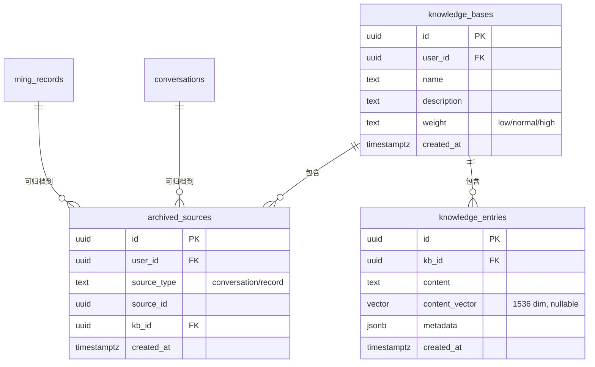
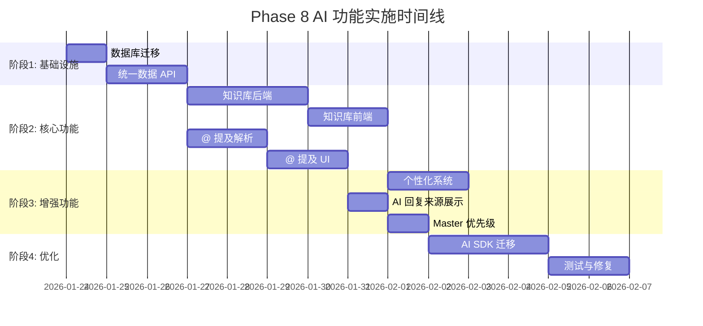

# MingAI Phase 8 AI 功能实施计划

**版本**: v1.1  
**创建日期**: 2026-01-23  
**更新日期**: 2026-01-23  
**状态**: 📋 待评审

> [!NOTE]
> v1.1 更新：根据架构评审意见进行重大调整，包括分离知识库与归档来源、条件化向量索引、检索分层设计、模块化数据 API 等。

---

## 1. 概述

本文档详细描述 MingAI Phase 8 中 AI 相关功能的实施计划，涵盖：

| 模块 | 优先级 | 复杂度 | 备注 |
|------|--------|--------|------|
| 知识库系统 | P0 | 高 | 核心功能，分离归档映射 |
| @ 提及功能 | P0 | 中 | 收敛为二级结构 |
| 统一数据 API | P1 | 中 | 模块化设计 |
| 个性化系统 | P1 | 中 | 层叠式 Prompt |
| AI 回复来源展示 | P1 | 低 | 绑定实际注入内容 |
| Master 数据优先级 | P2 | 低 | Token 限制策略 |
| ~~AI SDK 统一架构~~ | ~~P2~~ | ~~中~~ | **移至 Phase 9** |

> [!CAUTION]
> AI SDK 迁移已移至 Phase 9，避免干扰核心功能测试。当前 SSE 架构稳定，无需更改。

---

## 2. 现有架构分析

### 2.1 当前 AI 模块结构

```
src/lib/
├── ai.ts                    # AI 调用封装（流式/非流式）
├── ai-config.ts             # 模型配置（动态加载）
├── ai-access.ts             # 访问权限控制
├── ai-analysis.ts           # 分析结果处理
├── ai-analysis-query.ts     # 分析查询
└── ai-providers/            # 多供应商适配
    ├── base.ts
    ├── deepseek.ts
    ├── glm.ts
    ├── gemini.ts
    ├── qwen.ts
    └── openai-compatible.ts
```

### 2.2 现有数据表

| 数据类型 | 表名 | 关键字段 |
|---------|------|----------|
| 八字命盘 | `bazi_charts` | `chart_data`, `name`, `birth_date` |
| 紫微命盘 | `ziwei_charts` | `chart_data`, `name`, `birth_date` |
| 塔罗记录 | `tarot_readings` | `cards`, `question`, `spread_id` |
| 六爻记录 | `liuyao_divinations` | `hexagram_code`, `question` |
| MBTI记录 | `mbti_readings` | `mbti_type`, `scores` |
| 合盘记录 | `hepan_charts` | `person1_birth`, `person2_birth`, `type` |
| 面相记录 | `face_readings` | `analysis_type` |
| 手相记录 | `palm_readings` | `hand_type`, `analysis_type` |
| 命理记录 | `ming_records` | `title`, `content`, `category`, `tags` |
| 对话历史 | `conversations` | `messages`, `source_type`, `source_data` |

### 2.3 当前聊天组件

- [ChatComposer.tsx](file:///d:/AAA-Study/Projects/MingAI/src/components/chat/ChatComposer.tsx) - 输入框、附件、模型选择
- [ChatMessageList.tsx](file:///d:/AAA-Study/Projects/MingAI/src/components/chat/ChatMessageList.tsx) - 消息列表渲染
- [BaziChartSelector.tsx](file:///d:/AAA-Study/Projects/MingAI/src/components/chat/BaziChartSelector.tsx) - 命盘选择器

---

## 3. 功能模块详细设计

### 3.1 知识库系统 (P0)

> [!IMPORTANT]
> 核心功能，需优先实现。采用 Supabase Postgres + FTS + pgvector（条件性） + Qwen3-Reranker 分层检索架构。

#### 3.1.1 核心概念分离

> [!WARNING]
> 关键架构决策：分离 `knowledge_bases`（逻辑容器）与 `archived_sources`（归档映射），支持一个来源多次引用。

| 概念 | 表名 | 职责 |
|------|------|------|
| 知识库 | `knowledge_bases` | 用户创建的逻辑知识集合（如"职业规划"、"感情咨询"） |
| 归档来源 | `archived_sources` | 记录 conversation / record → KB 的映射关系 |
| 知识条目 | `knowledge_entries` | 实际存储的知识内容块 |



#### 3.1.2 数据库设计

##### [NEW] `supabase/migrations/20260124_create_knowledge_base_tables.sql`

```sql
-- ============================================
-- 1. 知识库表（逻辑容器）
-- ============================================
CREATE TABLE public.knowledge_bases (
    id UUID PRIMARY KEY DEFAULT gen_random_uuid(),
    user_id UUID NOT NULL REFERENCES auth.users(id) ON DELETE CASCADE,
    name TEXT NOT NULL,
    description TEXT,
    weight TEXT CHECK (weight IN ('low', 'normal', 'high')) DEFAULT 'normal',
    created_at TIMESTAMPTZ DEFAULT now(),
    updated_at TIMESTAMPTZ DEFAULT now()
);

-- ============================================
-- 2. 归档来源映射表（多对多）
-- ============================================
CREATE TABLE public.archived_sources (
    id UUID PRIMARY KEY DEFAULT gen_random_uuid(),
    user_id UUID NOT NULL REFERENCES auth.users(id) ON DELETE CASCADE,
    source_type TEXT NOT NULL CHECK (source_type IN ('conversation', 'record')),
    source_id UUID NOT NULL,
    kb_id UUID NOT NULL REFERENCES public.knowledge_bases(id) ON DELETE CASCADE,
    created_at TIMESTAMPTZ DEFAULT now(),
    -- 同一来源可以归档到同一知识库只能一次
    UNIQUE (source_type, source_id, kb_id)
);

-- ============================================
-- 3. 知识条目表
-- ============================================
CREATE TABLE public.knowledge_entries (
    id UUID PRIMARY KEY DEFAULT gen_random_uuid(),
    kb_id UUID NOT NULL REFERENCES public.knowledge_bases(id) ON DELETE CASCADE,
    content TEXT NOT NULL,
    content_vector vector(1536),  -- 可选，Pro 专属
    metadata JSONB,  -- {source_type, source_id, chunk_index, ...}
    created_at TIMESTAMPTZ DEFAULT now()
);

-- ============================================
-- 4. 索引设计
-- ============================================

-- FTS 索引（所有用户可用）
CREATE INDEX knowledge_entries_fts_idx 
    ON public.knowledge_entries 
    USING GIN (to_tsvector('simple', content));

-- 注意：向量索引延迟创建，由后台任务或 feature flag 控制
-- 见下方 3.1.3 向量索引策略

-- 归档来源查询优化
CREATE INDEX archived_sources_user_idx ON public.archived_sources(user_id);
CREATE INDEX archived_sources_source_idx ON public.archived_sources(source_type, source_id);
CREATE INDEX archived_sources_kb_idx ON public.archived_sources(kb_id);

-- ============================================
-- 5. RLS 策略
-- ============================================
ALTER TABLE public.knowledge_bases ENABLE ROW LEVEL SECURITY;
ALTER TABLE public.archived_sources ENABLE ROW LEVEL SECURITY;
ALTER TABLE public.knowledge_entries ENABLE ROW LEVEL SECURITY;

CREATE POLICY "用户只能访问自己的知识库" ON public.knowledge_bases
    FOR ALL USING (auth.uid() = user_id);

CREATE POLICY "用户只能访问自己的归档来源" ON public.archived_sources
    FOR ALL USING (auth.uid() = user_id);

CREATE POLICY "用户只能访问自己的知识条目" ON public.knowledge_entries
    FOR ALL USING (
        kb_id IN (SELECT id FROM public.knowledge_bases WHERE user_id = auth.uid())
    );
```

##### [NEW] `supabase/migrations/20260124_extend_source_tables.sql`

```sql
-- conversations 表扩展（标记是否已归档，不影响原有结构）
ALTER TABLE public.conversations 
    ADD COLUMN IF NOT EXISTS is_archived BOOLEAN DEFAULT false;

-- ming_records 表扩展
ALTER TABLE public.ming_records
    ADD COLUMN IF NOT EXISTS is_archived BOOLEAN DEFAULT false;

-- 注意：不再使用 archived_kb_id 单一外键，改用 archived_sources 多对多表
```

#### 3.1.3 向量索引策略

> [!CAUTION]
> 向量索引不应在 migration 中默认创建。Supabase Free 可能失败，会阻断整条 pipeline。

**策略**：向量索引延后创建，由 feature flag 控制。

##### [NEW] `src/lib/knowledge-base/vector-index.ts`

```typescript
/**
 * 向量索引管理
 * 仅 Pro 会员 + 后台管理触发
 */
export async function createVectorIndexIfNeeded(
    supabase: SupabaseClient
): Promise<{ success: boolean; error?: string }> {
    // 1. 检查是否已存在索引
    const { data: indexExists } = await supabase.rpc('check_vector_index_exists');
    if (indexExists) return { success: true };
    
    // 2. 检查 feature flag
    const vectorEnabled = await getFeatureFlag('VECTOR_SEARCH_ENABLED');
    if (!vectorEnabled) {
        return { success: false, error: 'Vector search not enabled' };
    }
    
    // 3. 异步创建索引（可能耗时）
    try {
        await supabase.rpc('create_vector_index');
        return { success: true };
    } catch (error) {
        console.error('Failed to create vector index:', error);
        return { success: false, error: String(error) };
    }
}
```

##### [NEW] `supabase/functions/create_vector_index.sql`

```sql
-- 手动触发的向量索引创建函数
CREATE OR REPLACE FUNCTION public.create_vector_index()
RETURNS void
LANGUAGE plpgsql
SECURITY DEFINER
AS $$
BEGIN
    -- 检查是否已存在
    IF NOT EXISTS (
        SELECT 1 FROM pg_indexes 
        WHERE indexname = 'knowledge_entries_vector_idx'
    ) THEN
        CREATE INDEX CONCURRENTLY knowledge_entries_vector_idx 
            ON public.knowledge_entries 
            USING ivfflat (content_vector vector_cosine_ops) 
            WITH (lists = 100);
    END IF;
END;
$$;

CREATE OR REPLACE FUNCTION public.check_vector_index_exists()
RETURNS boolean
LANGUAGE sql
SECURITY DEFINER
AS $$
    SELECT EXISTS (
        SELECT 1 FROM pg_indexes 
        WHERE indexname = 'knowledge_entries_vector_idx'
    );
$$;
```

#### 3.1.4 后端实现（分层检索）

> [!IMPORTANT]
> 检索拆分为两步：`searchCandidates()`（召回）+ `rerankCandidates()`（精排），便于分层测试和会员权益控制。

##### [NEW] `src/lib/knowledge-base/index.ts`

```typescript
// ============================================
// 知识库 CRUD
// ============================================
export async function createKnowledgeBase(userId: string, data: KBInput): Promise<KB>
export async function deleteKnowledgeBase(kbId: string): Promise<void>
export async function updateKnowledgeBase(kbId: string, data: Partial<KBInput>): Promise<KB>
export async function getKnowledgeBases(userId: string): Promise<KB[]>

// ============================================
// 归档管理
// ============================================
export async function archiveSource(params: {
    userId: string;
    sourceType: 'conversation' | 'record';
    sourceId: string;
    kbId: string;
}): Promise<ArchivedSource>

export async function unarchiveSource(archivedSourceId: string): Promise<void>

export async function getArchivedSources(
    userId: string, 
    kbId?: string
): Promise<ArchivedSource[]>

// 检查来源是否已归档到某知识库
export async function isSourceArchived(
    sourceType: 'conversation' | 'record',
    sourceId: string,
    kbId?: string
): Promise<boolean>
```

##### [NEW] `src/lib/knowledge-base/search.ts`

```typescript
/**
 * 第一步：召回候选结果（FTS / Vector）
 * 所有 Plus+ 会员可用
 */
export async function searchCandidates(
    userId: string,
    query: string,
    options: SearchOptions
): Promise<SearchCandidate[]> {
    const { kbIds, limit = 20, useVector = false } = options;
    
    // FTS 搜索（默认）
    const ftsResults = await searchByFTS(userId, query, kbIds, limit);
    
    // Vector 搜索（可选，Pro限）
    if (useVector && await hasVectorCapability(userId)) {
        const vectorResults = await searchByVector(userId, query, kbIds, limit);
        return mergeResults(ftsResults, vectorResults);
    }
    
    return ftsResults;
}

/**
 * 第二步：精排候选结果（Rerank）
 * 仅 Pro 会员可用
 */
export async function rerankCandidates(
    query: string,
    candidates: SearchCandidate[],
    topK: number = 5
): Promise<RankedResult[]> {
    // Qwen3-Reranker 调用
    return await callReranker(query, candidates, topK);
}

/**
 * 便捷方法：完整检索流程
 */
export async function searchKnowledge(
    userId: string,
    query: string,
    options: SearchOptions
): Promise<SearchResult[]> {
    const membership = await getUserMembership(userId);
    
    // Step 1: 召回
    const candidates = await searchCandidates(userId, query, {
        ...options,
        useVector: membership === 'pro'
    });
    
    // Step 2: 精排（Pro only）
    if (membership === 'pro' && candidates.length > 0) {
        return await rerankCandidates(query, candidates, options.topK);
    }
    
    return candidates;
}
```

##### [NEW] `src/lib/knowledge-base/reranker.ts`

```typescript
/**
 * Qwen3-Reranker 集成
 * API: DashScope / 本地部署
 */
export interface RerankerConfig {
    provider: 'dashscope' | 'local';
    model: string;
    apiKey?: string;
    endpoint?: string;
}

export async function callReranker(
    query: string,
    candidates: SearchCandidate[],
    topK: number
): Promise<RankedResult[]> {
    const config = getRerankerConfig();
    
    if (config.provider === 'dashscope') {
        return await callDashScopeReranker(query, candidates, topK, config);
    }
    
    return await callLocalReranker(query, candidates, topK, config);
}

// DashScope API 调用
async function callDashScopeReranker(
    query: string,
    candidates: SearchCandidate[],
    topK: number,
    config: RerankerConfig
): Promise<RankedResult[]> {
    const response = await fetch(`${config.endpoint}/rerank`, {
        method: 'POST',
        headers: {
            'Authorization': `Bearer ${config.apiKey}`,
            'Content-Type': 'application/json'
        },
        body: JSON.stringify({
            model: config.model,
            query,
            documents: candidates.map(c => c.content),
            top_n: topK
        })
    });
    
    const data = await response.json();
    return data.results.map((r: any, i: number) => ({
        ...candidates[r.index],
        score: r.relevance_score,
        rank: i + 1
    }));
}
```

##### [NEW] `src/app/api/knowledge-base/route.ts`

```typescript
// GET    /api/knowledge-base             - 获取知识库列表
// POST   /api/knowledge-base             - 创建知识库
// GET    /api/knowledge-base/[id]        - 获取单个知识库
// PATCH  /api/knowledge-base/[id]        - 更新知识库
// DELETE /api/knowledge-base/[id]        - 删除知识库
```

##### [NEW] `src/app/api/knowledge-base/archive/route.ts`

```typescript
// POST   /api/knowledge-base/archive     - 归档来源到知识库
// DELETE /api/knowledge-base/archive/[id] - 取消归档
// GET    /api/knowledge-base/archive     - 获取归档列表
```

##### [NEW] `src/app/api/knowledge-base/search/route.ts`

```typescript
// POST   /api/knowledge-base/search      - 检索知识库
// Request: { query: string, kbIds?: string[], topK?: number }
// Response: { candidates: SearchCandidate[], ranked?: RankedResult[] }
```

#### 3.1.5 会员权益限制

| 权益 | Free | Plus | Pro |
|------|------|------|-----|
| 创建知识库 | ❌ | 3个 | 10个 |
| 归档来源 | ❌ | ✅ | ✅ |
| FTS 检索 | ❌ | ✅ | ✅ |
| Vector 检索 | ❌ | ❌ | ✅ |
| Rerank 精排 | ❌ | ❌ | ✅ |
| 自动命中 | ❌ | ❌ | ✅ |

---

### 3.2 @ 提及功能 (P0)

> [!IMPORTANT]
> 允许用户在对话中显式引用数据源，优先级最高。

#### 3.2.1 支持的提及类型

| 前缀 | 数据源 | 示例 |
|------|--------|------|
| `@知识库` | 用户知识库 | `@知识库:职业规划` |
| `@八字命盘` | bazi_charts | `@八字命盘:张三` |
| `@紫薇命盘` | ziwei_charts | `@紫薇命盘:李四` |
| `@塔罗记录` | tarot_readings | `@塔罗记录:单牌-问工作` |
| `@六爻记录` | liuyao_divinations | `@六爻记录:x卦-问工作` |
| `@面相记录` | face_readings | `@面相记录:2026-01-22` |
| `@手相记录` | palm_readings | `@手相记录:2026-01-22` |
| `@MBTI记录` | mbti_readings | `@MBTI记录:enfj-2026-01-22` |
| `@合盘记录` | hepan_charts | `@合盘记录:xxx与xxx-爱情` |
| `@命理记录` | ming_records | `@命理记录:标题-2026-01-22` |
| `@今日运势` | 动态计算 | `@日运:2026年1月22日` |
| `@某月运势` | 动态计算 | `@月运:2026年1月` |

#### 3.2.2 组件实现

##### [NEW] `src/components/chat/MentionPopover.tsx`

```tsx
interface MentionPopoverProps {
    query: string;           // 当前输入的查询
    userId: string;
    onSelect: (mention: Mention) => void;
    onClose: () => void;
}

// 功能：
// - 输入 @ 后弹出
// - 分类展示可选数据源
// - 支持模糊搜索
// - 键盘导航
```

##### [MODIFY] `src/components/chat/ChatComposer.tsx`

- 添加 `@` 触发检测
- 集成 `MentionPopover`
- 维护 `mentions` 状态列表
- 发送前展示「将注入 AI 的内容摘要」

#### 3.2.3 后端实现

##### [NEW] `src/lib/mentions.ts`

```typescript
export interface Mention {
    type: MentionType;
    id?: string;
    name: string;
    preview: string;  // 摘要预览
}

// 解析消息中的 @ 提及
export function parseMentions(content: string): Mention[]

// 获取提及数据的完整内容
export async function resolveMention(mention: Mention, userId: string): Promise<string>

// 搜索可用的提及目标
export async function searchMentionTargets(
    userId: string, 
    type: MentionType, 
    query: string
): Promise<MentionTarget[]>
```

##### [MODIFY] `src/app/api/chat/route.ts`

- 解析消息中的 mentions
- 获取并格式化提及数据
- 注入到 prompt 上下文

---

### 3.3 统一数据访问 API (P1)

> 整合所有命理数据，提供统一入口供 AI 访问。

#### 3.3.1 实现

##### [NEW] `src/lib/unified-data-api.ts`

```typescript
export interface DataSource {
    type: DataType;
    id: string;
    name: string;
    summary: string;
    fullContent: string;
    createdAt: string;
}

// 获取用户所有数据源列表
export async function getUserDataSources(userId: string): Promise<DataSourceSummary[]>

// 获取单个数据源完整内容
export async function getDataSource(type: DataType, id: string): Promise<DataSource>

// 批量获取数据源
export async function getDataSources(refs: DataRef[]): Promise<DataSource[]>

// 数据格式化器
export function formatBaziForAI(chart: BaziChart): string
export function formatZiweiForAI(chart: ZiweiChart): string
export function formatTarotForAI(reading: TarotReading): string
export function formatLiuyaoForAI(divination: LiuyaoDivination): string
export function formatMBTIForAI(reading: MBTIReading): string
export function formatHepanForAI(chart: HepanChart): string
export function formatFortuneForAI(date: Date, chart?: BaziChart): string
```

##### [NEW] `src/app/api/data-sources/route.ts`

- `GET /api/data-sources` - 获取用户数据源列表
- `GET /api/data-sources/[type]/[id]` - 获取单个数据源

---

### 3.4 个性化系统 (P1)

#### 3.4.1 数据库扩展

##### [MODIFY] `supabase/migrations/20260124_extend_user_settings.sql`

```sql
ALTER TABLE public.user_settings
    ADD COLUMN custom_instructions TEXT,           -- 自定义指令
    ADD COLUMN expression_style TEXT CHECK (expression_style IN ('direct', 'gentle')) DEFAULT 'direct',
    ADD COLUMN user_profile JSONB DEFAULT '{}';    -- 关于用户的详情
```

#### 3.4.2 实现

##### [MODIFY] `src/lib/ai.ts`

```typescript
// 构建个性化 prompt
function buildPersonalizedPrompt(
    personality: AIPersonality,
    userSettings: UserSettings
): string {
    // 1. 基础人格 prompt
    // 2. + 表达风格偏好
    // 3. + 用户详情
    // 4. + 自定义指令
}
```

##### [NEW] `src/app/user/settings/ai/page.tsx`

- 表达风格选择（直说/委婉）
- 关于你（用户详情编辑）
- 自定义指令输入

---

### 3.5 AI 回复来源展示 (P1)

#### 3.5.1 数据结构

```typescript
interface AIMessageMetadata {
    sources?: {
        type: 'knowledge_base' | 'data_source';
        name: string;
        id: string;
    }[];
}
```

#### 3.5.2 实现

##### [MODIFY] `src/components/chat/ChatMessageList.tsx`

- 识别 AI 消息中的 metadata.sources
- 渲染来源标签/折叠面板

##### [NEW] `src/components/chat/SourceBadge.tsx`

```tsx
// 来源标签组件
export function SourceBadge({ source }: { source: Source }) {
    return (
        <span className="inline-flex items-center px-2 py-0.5 rounded text-xs bg-accent/10">
            <Database className="w-3 h-3 mr-1" />
            {source.name}
        </span>
    );
}
```

---

### 3.6 Master 数据优先级 (P2)

> [!NOTE]
> 定义 AI 使用数据的优先级规则，确保推理有据可依。

#### 优先级顺序

1. **@ 显式引用** - 用户明确指定的数据
2. **用户知识库** - 高权重 > 普通 > 低权重
3. **系统结构化数据** - 已保存的命盘、历史记录
4. **推理判断** - 基于已有数据的 AI 推理

#### 实现

##### [MODIFY] `src/lib/ai.ts`

更新 `AI_PERSONALITIES.master.systemPrompt`：

```
## 数据使用规则
1. 优先使用用户 @ 显式引用的数据
2. 其次参考用户知识库（按权重排序）
3. 再次使用系统已有的命盘和历史数据
4. 信息不足时明确提示「条件不足，无法准确判断」
5. 禁止编造不存在的数据
6. 推理结论需注明数据来源
```

---

### 3.7 AI SDK 统一架构 (P2)

> [!NOTE]
> 可选优化项，统一采用 Vercel AI SDK 替代手动 SSE 处理。

#### 变更范围

| 文件 | 变更 |
|------|------|
| `src/lib/ai.ts` | 使用 `createOpenAI`/`streamText` |
| `src/lib/ai-providers/*.ts` | 适配 AI SDK provider 接口 |
| `src/app/api/chat/route.ts` | 使用 `StreamingTextResponse` |

#### 保留 Master 人格

删除 `healer` 和 `scholar` 配置，仅保留 `master`。

---

## 4. 实施阶段



---

## 5. 验证计划

### 5.1 自动化测试

```bash
# 知识库测试
pnpm test src/tests/knowledge-base.test.ts

# @ 提及测试
pnpm test src/tests/mentions.test.ts

# 统一数据 API 测试
pnpm test src/tests/unified-data-api.test.ts
```

### 5.2 手动验证

| 场景 | 验证步骤 |
|------|----------|
| 知识库创建 | 创建 → 上传内容 → 设置权重 → 验证存储 |
| 对话归档 | 归档对话 → 验证对话隐藏 → 取消归档 → 对话恢复 |
| @ 提及 | 输入@ → 选择数据 → 发送 → 验证 AI 收到数据 |
| 来源展示 | AI 引用知识库 → 验证来源标签显示 |

---

## 6. 风险与缓解

| 风险 | 影响 | 缓解措施 |
|------|------|----------|
| pgvector 性能 | 检索延迟 | 限制向量条目数量，Pro 专属 |
| Reranker 成本 | API 费用 | 仅 Pro 开启，high 权重优先 |
| 数据隐私 | 用户数据泄露 | RLS 策略，严格权限检查 |

---

## 7. 相关文件索引

| 类型 | 文件 |
|------|------|
| PRD | [PRD-MingAI-v2.0.md](file:///d:/AAA-Study/Projects/MingAI/docs/plans/PRD-MingAI-v2.0.md#L609-L651) |
| AI 核心 | [ai.ts](file:///d:/AAA-Study/Projects/MingAI/src/lib/ai.ts) |
| 模型配置 | [ai-config.ts](file:///d:/AAA-Study/Projects/MingAI/src/lib/ai-config.ts) |
| 聊天输入 | [ChatComposer.tsx](file:///d:/AAA-Study/Projects/MingAI/src/components/chat/ChatComposer.tsx) |
| 消息列表 | [ChatMessageList.tsx](file:///d:/AAA-Study/Projects/MingAI/src/components/chat/ChatMessageList.tsx) |
| 对话 API | [chat/route.ts](file:///d:/AAA-Study/Projects/MingAI/src/app/api/chat/route.ts) |
| 数据库 Schema | [tabel_export_from_supabase.sql](file:///d:/AAA-Study/Projects/MingAI/supabase/tabel_export_from_supabase.sql) |
